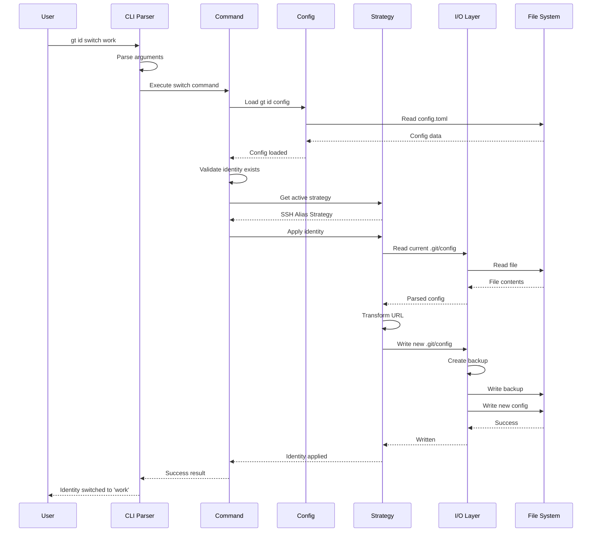
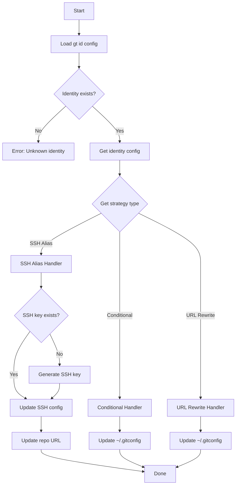
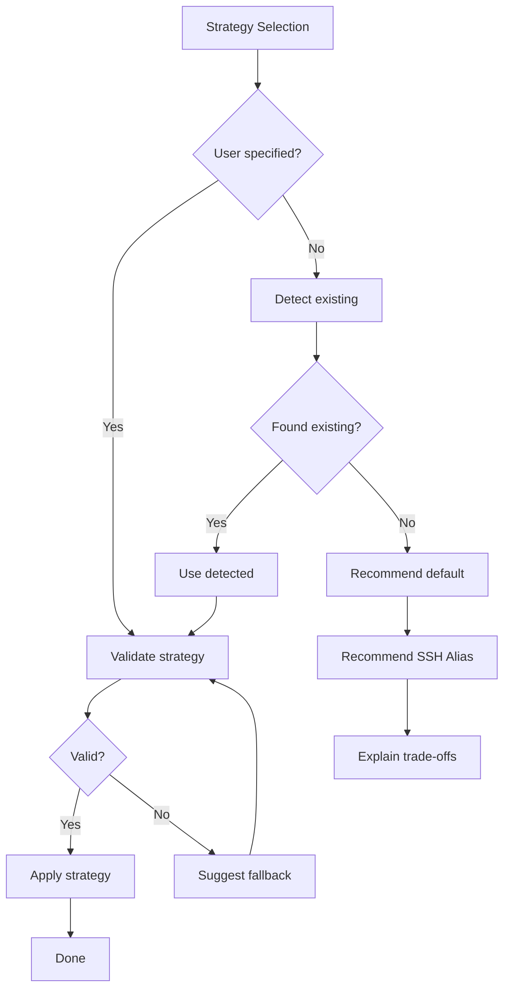

# 001 - Architecture Overview

This document describes the high-level architecture of gt, including module organization, data flow, and design patterns.

## Table of Contents

- [System Overview](#system-overview)
- [Core Design Principles](#core-design-principles)
- [Module Architecture](#module-architecture)
- [Project Structure](#project-structure)
- [Data Flow](#data-flow)
- [Strategy Pattern](#strategy-pattern)
- [Error Handling](#error-handling)

## System Overview

gt is a CLI application that manages Git identities across multiple providers and repositories. It supports three distinct strategies for identity management, all unified under a single command-line interface.

```mermaid
graph TB
    subgraph "User Interface"
        CLI[CLI Commands]
    end

    subgraph "Core Engine"
        CMD[Command Router]
        CFG[Config Manager]
        SCN[Scanner]
        IDM[Identity Manager]
    end

    subgraph "Strategies"
        SSH[SSH Alias Strategy]
        CND[Conditional Strategy]
        URL[URL Rewrite Strategy]
    end

    subgraph "I/O Layer"
        SSHIO[SSH Config I/O]
        GITIO[Git Config I/O]
        KEYIO[SSH Key I/O]
        BKUP[Backup Manager]
    end

    subgraph "External"
        SSHCFG[(~/.ssh/config)]
        GITCFG[(~/.gitconfig)]
        KEYS[(SSH Keys)]
        REPO[(.git/config)]
    end

    CLI --> CMD
    CMD --> CFG
    CMD --> SCN
    CMD --> IDM

    IDM --> SSH
    IDM --> CND
    IDM --> URL

    SSH --> SSHIO
    CND --> GITIO
    URL --> GITIO

    SSHIO --> BKUP
    GITIO --> BKUP
    KEYIO --> KEYS

    SSHIO --> SSHCFG
    GITIO --> GITCFG
    GITIO --> REPO
end
```

## Core Design Principles

### 1. DRY (Don't Repeat Yourself)

All shared functionality is abstracted into reusable modules:

- **URL parsing** is centralized in `core::url`
- **Config parsing** uses shared traits in `io::parser`
- **Path handling** is unified in `core::path`

### 2. SOLID Principles

- **Single Responsibility**: Each module has one clear purpose
- **Open/Closed**: Strategy pattern allows extension without modification
- **Liskov Substitution**: All strategies implement the same trait
- **Interface Segregation**: Traits are small and focused
- **Dependency Inversion**: Core depends on abstractions, not implementations

### 3. Separation of Concerns

```
Layer          | Responsibility
---------------|------------------------------------------
CLI            | Parse arguments, format output
Commands       | Orchestrate operations, handle user flow
Core           | Business logic, domain models
Strategies     | Strategy-specific implementations
I/O            | File system operations, parsing, writing
```

### 4. Fail-Safe Design

- All destructive operations create backups first
- Operations are atomic where possible
- Clear error messages with recovery suggestions

## Module Architecture

### Module Dependency Graph

```mermaid
graph TD
    subgraph "Binary"
        MAIN[main.rs]
    end

    subgraph "Commands Layer"
        CMD_INIT[cmd::init]
        CMD_SCAN[cmd::scan]
        CMD_ADD[cmd::add]
        CMD_SWITCH[cmd::switch]
        CMD_CLONE[cmd::clone]
        CMD_CONFIG[cmd::config]
        CMD_MIGRATE[cmd::migrate]
        CMD_FIX[cmd::fix]
        CMD_KEY[cmd::key]
        CMD_STATUS[cmd::status]
        CMD_LIST[cmd::list]
    end

    subgraph "Core Layer"
        CORE_ID[core::identity]
        CORE_REPO[core::repo]
        CORE_URL[core::url]
        CORE_PATH[core::path]
        CORE_PROVIDER[core::provider]
    end

    subgraph "Strategy Layer"
        STRAT_TRAIT[strategy::Strategy trait]
        STRAT_SSH[strategy::ssh_alias]
        STRAT_COND[strategy::conditional]
        STRAT_URL[strategy::url_rewrite]
        STRAT_FACTORY[strategy::factory]
    end

    subgraph "I/O Layer"
        IO_SSH[io::ssh_config]
        IO_GIT[io::git_config]
        IO_KEY[io::ssh_key]
        IO_BACKUP[io::backup]
        IO_TOML[io::toml_config]
    end

    subgraph "Shared"
        ERR[error]
        UTIL[util]
    end

    MAIN --> CMD_INIT
    MAIN --> CMD_SCAN

    CMD_INIT --> CORE_ID
    CMD_INIT --> STRAT_FACTORY
    CMD_SCAN --> IO_SSH
    CMD_SCAN --> IO_GIT

    STRAT_SSH --> IO_SSH
    STRAT_COND --> IO_GIT
    STRAT_URL --> IO_GIT

    STRAT_SSH --> STRAT_TRAIT
    STRAT_COND --> STRAT_TRAIT
    STRAT_URL --> STRAT_TRAIT

    IO_SSH --> IO_BACKUP
    IO_GIT --> IO_BACKUP
    IO_KEY --> CORE_PATH

    CORE_URL --> CORE_PROVIDER
    CORE_REPO --> CORE_URL
end
```

## Project Structure

```
rust/
├── Cargo.toml                 # Project manifest
├── Cargo.lock                 # Dependency lock file
├── README.md                  # Project README (links to docs/)
├── docs/                      # Documentation
│   ├── README.md              # Documentation index
│   ├── 001-architecture.md    # This file
│   ├── 002-strategies.md      # Strategy deep dive
│   ├── 003-cli-reference.md   # CLI reference
│   ├── 004-configuration.md   # Configuration guide
│   ├── 005-security.md        # Security considerations
│   ├── 006-cross-platform.md  # Platform compatibility
│   ├── 007-migration.md       # Migration guide
│   ├── 008-development.md     # Developer guide
│   └── 009-big-picture.md     # System overview diagram
├── src/
│   ├── main.rs                # Entry point, CLI setup
│   ├── lib.rs                 # Library root, re-exports
│   │
│   ├── cli/                   # CLI layer
│   │   ├── mod.rs             # CLI module root
│   │   ├── args.rs            # Argument definitions (clap)
│   │   ├── output.rs          # Output formatting (terminal, JSON, CSV)
│   │   └── interactive.rs     # Interactive prompts (dialoguer)
│   │
│   ├── cmd/                   # Command implementations
│   │   ├── mod.rs             # Command module root
│   │   ├── init.rs            # gt id init
│   │   ├── scan.rs            # gt id scan
│   │   ├── add.rs             # gt config id add
│   │   ├── list.rs            # gt config id list
│   │   ├── switch.rs          # gt id switch
│   │   ├── clone.rs           # gt id clone
│   │   ├── config.rs          # gt id config
│   │   ├── migrate.rs         # gt config id migrate
│   │   ├── fix.rs             # gt id fix
│   │   ├── key.rs             # gt config id key (subcommands)
│   │   └── status.rs          # gt config id status
│   │
│   ├── core/                  # Core business logic
│   │   ├── mod.rs             # Core module root
│   │   ├── identity.rs        # Identity model and operations
│   │   ├── repo.rs            # Repository detection and operations
│   │   ├── url.rs             # Git URL parsing and transformation
│   │   ├── path.rs            # Cross-platform path utilities
│   │   └── provider.rs        # Git provider definitions
│   │
│   ├── strategy/              # Identity strategies
│   │   ├── mod.rs             # Strategy trait and factory
│   │   ├── ssh_alias.rs       # SSH hostname alias strategy
│   │   ├── conditional.rs     # Git conditional includes strategy
│   │   └── url_rewrite.rs     # URL insteadOf strategy
│   │
│   ├── io/                    # I/O operations
│   │   ├── mod.rs             # I/O module root
│   │   ├── ssh_config.rs      # SSH config parser/writer
│   │   ├── git_config.rs      # Git config parser/writer
│   │   ├── ssh_key.rs         # SSH key generation/management
│   │   ├── backup.rs          # Backup manager
│   │   └── toml_config.rs     # gt id config parser/writer
│   │
│   ├── scan/                  # Scanning and detection
│   │   ├── mod.rs             # Scan module root
│   │   ├── detector.rs        # Strategy detector
│   │   ├── ssh_scanner.rs     # SSH config scanner
│   │   ├── git_scanner.rs     # Git config scanner
│   │   └── report.rs          # Scan report generation
│   │
│   ├── error.rs               # Error types and handling
│   └── util.rs                # Shared utilities
│
└── tests/                     # Integration tests
    ├── common/                # Test utilities
    │   └── mod.rs
    ├── init_test.rs
    ├── scan_test.rs
    ├── strategy_test.rs
    └── fixtures/              # Test fixtures
        ├── ssh_config/
        ├── git_config/
        └── repos/
```

## Data Flow

### Command Execution Flow



### Identity Resolution Flow



## Strategy Pattern

The three identity strategies are implemented using a common trait, allowing uniform handling while supporting strategy-specific behavior.

### Strategy Trait Definition

```rust
/// Core trait that all identity strategies must implement
pub trait Strategy: Send + Sync {
    /// Returns the strategy type identifier
    fn strategy_type(&self) -> StrategyType;

    /// Applies the identity to a repository
    fn apply(&self, identity: &Identity, repo: &Repo) -> Result<ApplyResult>;

    /// Removes the identity from a repository
    fn remove(&self, identity: &Identity, repo: &Repo) -> Result<()>;

    /// Checks if this strategy is currently active for the repo
    fn is_active(&self, identity: &Identity, repo: &Repo) -> Result<bool>;

    /// Validates the strategy can be used in current environment
    fn validate(&self) -> Result<ValidationResult>;

    /// Returns required setup steps for this strategy
    fn setup_requirements(&self) -> Vec<SetupStep>;
}
```

### Strategy Selection



## Error Handling

### Error Type Hierarchy

```rust
#[derive(Debug, thiserror::Error)]
pub enum Error {
    // Configuration errors
    #[error("Configuration error: {0}")]
    Config(#[from] ConfigError),

    // I/O errors
    #[error("I/O error: {0}")]
    Io(#[from] std::io::Error),

    // Strategy errors
    #[error("Strategy error: {0}")]
    Strategy(#[from] StrategyError),

    // Identity errors
    #[error("Identity error: {0}")]
    Identity(#[from] IdentityError),

    // Git errors
    #[error("Git error: {0}")]
    Git(#[from] GitError),

    // SSH errors
    #[error("SSH error: {0}")]
    Ssh(#[from] SshError),
}
```

### Error Recovery

Each error type includes:
- Clear error message
- Suggested recovery action
- Context for debugging

```rust
#[derive(Debug, thiserror::Error)]
pub enum IdentityError {
    #[error("Identity '{name}' not found. Run 'gt config id list' to see available identities.")]
    NotFound { name: String },

    #[error("Identity '{name}' already exists. Use 'gt id config' to modify it.")]
    AlreadyExists { name: String },

    #[error("Invalid identity name '{name}': {reason}")]
    InvalidName { name: String, reason: String },
}
```

## Next Steps

Continue to [002-strategies.md](002-strategies.md) for detailed documentation of each identity management strategy.
