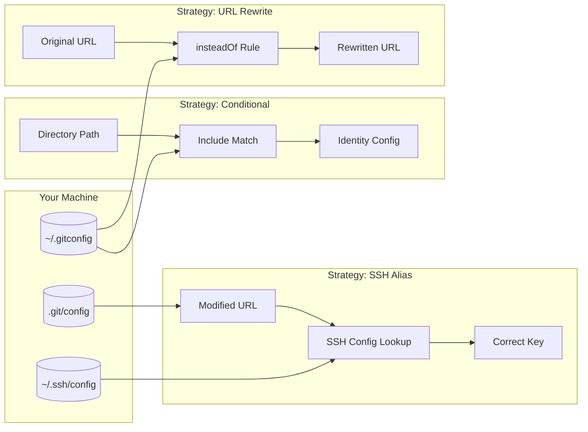
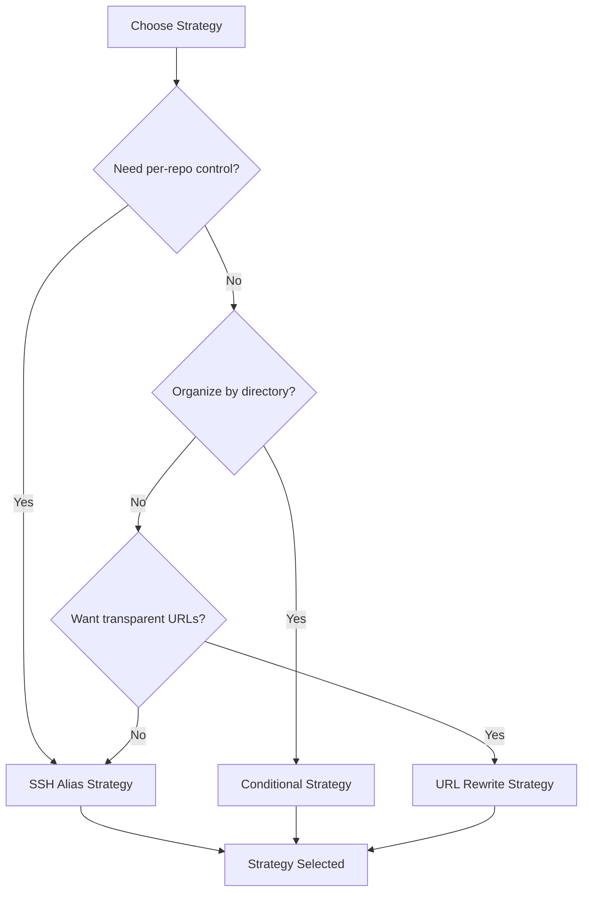
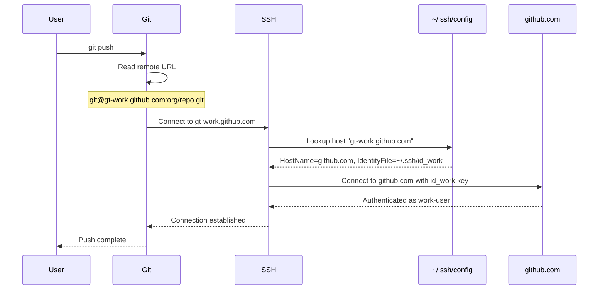
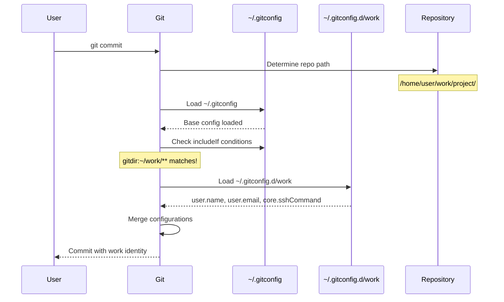
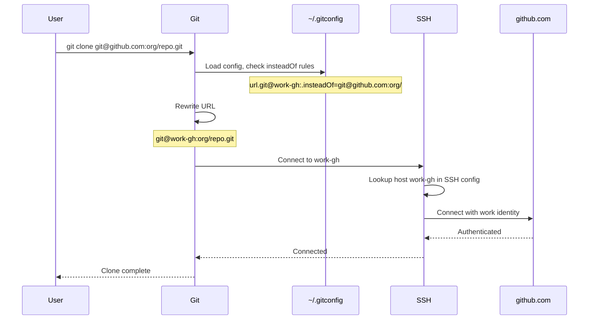
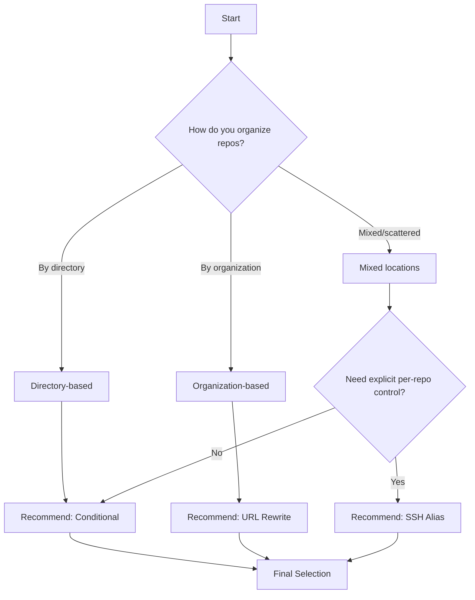
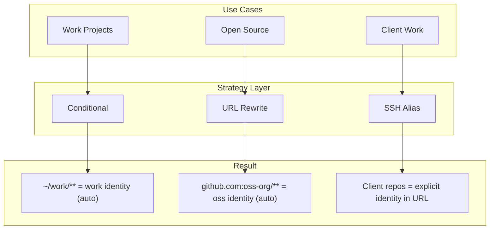

# 002 - Identity Management Strategies

This document provides a deep dive into the three identity management strategies supported by gt.

## Table of Contents

- [Overview](#overview)
- [Strategy Comparison](#strategy-comparison)
- [SSH Hostname Alias Strategy](#ssh-hostname-alias-strategy)
- [Git Conditional Includes Strategy](#git-conditional-includes-strategy)
- [URL Rewrite Strategy](#url-rewrite-strategy)
- [Strategy Selection Guide](#strategy-selection-guide)
- [Mixing Strategies](#mixing-strategies)

## Overview

Git identity management is the challenge of using different credentials (SSH keys, user names, emails) for different repositories. This is common when:

- You have personal and work GitHub accounts
- You contribute to open source with a different identity
- You work with multiple organizations
- You use multiple Git providers (GitHub, GitLab, Bitbucket)

gt supports three distinct strategies, each with trade-offs.

### High-Level Strategy Overview



## Strategy Comparison

| Feature | SSH Alias | Conditional | URL Rewrite |
|---------|-----------|-------------|-------------|
| **Scope** | Per-repository | Per-directory | Global patterns |
| **URL Modification** | Yes | No | No (transparent) |
| **Setup Complexity** | Medium | Low | Low |
| **SSH Key Management** | Explicit | Separate | Separate |
| **Provider Detection** | Requires parsing | Native | Native |
| **Clone Command** | Modified URL | Standard | Standard |
| **Cross-Platform** | Full | Full | Full |
| **Visibility** | URL shows identity | Directory shows intent | Hidden |

### When to Use Each



## SSH Hostname Alias Strategy

The SSH Alias strategy modifies Git remote URLs to include an identity marker, which SSH config maps to the correct key.

### How It Works



### URL Transformation

```
Original URL:
  git@github.com:company/project.git

Transformed URL (identity: "work"):
  git@gt-work.github.com:company/project.git

SSH Config Entry:
  Host gt-work.github.com
    HostName github.com
    User git
    IdentityFile ~/.ssh/id_gt_work
    IdentitiesOnly yes
```

### SSH Config Structure

```
# ~/.ssh/config

# Global settings
Host *
    AddKeysToAgent yes
    IdentitiesOnly yes

# gt: personal identity
Host gt-personal.github.com
    HostName github.com
    User git
    IdentityFile ~/.ssh/id_gt_personal
    IdentitiesOnly yes
    PreferredAuthentications publickey

# gt: work identity
Host gt-work.github.com
    HostName github.com
    User git
    IdentityFile ~/.ssh/id_gt_work
    IdentitiesOnly yes
    PreferredAuthentications publickey

# gt: client identity for GitLab
Host gt-client.gitlab.com
    HostName gitlab.com
    User git
    IdentityFile ~/.ssh/id_gt_client
    IdentitiesOnly yes
    PreferredAuthentications publickey
```

### Provider Detection from Modified URLs

When URLs are already modified, gt detects the original provider:

```rust
// URL patterns and provider detection
fn detect_provider(url: &str) -> Option<Provider> {
    // Pattern: git@gt-{identity}.{provider}.{tld}:...
    let modified_re = Regex::new(
        r"^git@gt-[^.]+\.([^:]+):.*$"
    )?;

    if let Some(caps) = modified_re.captures(url) {
        let host = caps.get(1)?.as_str();
        return Provider::from_hostname(host);
    }

    // Standard URL patterns
    let standard_re = Regex::new(r"^git@([^:]+):.*$")?;
    // ...
}
```

### Advantages

- **Explicit identity per repository**: Each repo's URL shows which identity it uses
- **Works with any Git operation**: Clone, push, pull, fetch all work seamlessly
- **No directory structure requirements**: Repos can be anywhere on disk
- **Portable**: Clone URL contains identity information

### Disadvantages

- **Modified URLs**: URLs don't match official repository URLs
- **Manual URL adjustment**: When cloning, need to modify URL or use `gt id clone`
- **Provider detection complexity**: Need to parse modified URLs to find original provider

## Git Conditional Includes Strategy

The Conditional strategy uses Git's built-in `includeIf` directive to apply configurations based on repository location.

### How It Works



### Configuration Structure

```gitconfig
# ~/.gitconfig

[user]
    name = Personal Name
    email = personal@email.com

[includeIf "gitdir:~/work/"]
    path = ~/.gitconfig.d/work

[includeIf "gitdir:~/opensource/"]
    path = ~/.gitconfig.d/opensource

[includeIf "gitdir:~/client-projects/"]
    path = ~/.gitconfig.d/client
```

```gitconfig
# ~/.gitconfig.d/work

[user]
    name = Work Name
    email = work@company.com

[core]
    sshCommand = ssh -i ~/.ssh/id_work -o IdentitiesOnly=yes
```

### Directory Structure

```
~/
├── personal/           # Uses default identity
│   ├── blog/
│   └── dotfiles/
├── work/               # Uses work identity (includeIf gitdir:~/work/)
│   ├── project-a/
│   └── project-b/
├── opensource/         # Uses opensource identity
│   ├── contribution-1/
│   └── contribution-2/
└── client-projects/    # Uses client identity
    └── client-repo/
```

### Advantages

- **Standard URLs**: No URL modification needed
- **Automatic identity**: Based on where you clone/work
- **Git-native**: Uses built-in Git functionality
- **Simple mental model**: "Work repos go in ~/work"

### Disadvantages

- **Directory discipline required**: Must organize repos by identity
- **Less flexible**: Can't easily use different identities in same directory
- **SSH key management separate**: Need additional core.sshCommand or SSH config

## URL Rewrite Strategy

The URL Rewrite strategy uses Git's `url.<base>.insteadOf` configuration to transparently rewrite URLs.

### How It Works



### Configuration Structure

```gitconfig
# ~/.gitconfig

# Rewrite work organization URLs
[url "git@work-gh:"]
    insteadOf = git@github.com:work-org/

# Rewrite personal URLs
[url "git@personal-gh:"]
    insteadOf = git@github.com:personal-user/

# Rewrite all GitLab to use work identity
[url "git@work-gl:"]
    insteadOf = git@gitlab.com:
```

```
# ~/.ssh/config

Host work-gh
    HostName github.com
    User git
    IdentityFile ~/.ssh/id_work

Host personal-gh
    HostName github.com
    User git
    IdentityFile ~/.ssh/id_personal

Host work-gl
    HostName gitlab.com
    User git
    IdentityFile ~/.ssh/id_work
```

### Pattern Matching

URL rewriting supports various patterns:

```gitconfig
# Organization-level rewrite
[url "git@work:"]
    insteadOf = git@github.com:acme-corp/

# User-level rewrite
[url "git@personal:"]
    insteadOf = git@github.com:myusername/

# Entire provider rewrite
[url "git@work-gitlab:"]
    insteadOf = git@gitlab.com:

# HTTPS to SSH conversion with identity
[url "git@work:"]
    insteadOf = https://github.com/acme-corp/
```

### Advantages

- **Transparent operation**: Standard URLs work automatically
- **Pattern-based**: Can match organizations, users, or entire providers
- **HTTPS conversion**: Can convert HTTPS URLs to SSH with identity
- **No URL modification visible**: `git remote -v` shows rewritten URL is used internally

### Disadvantages

- **Global patterns**: Less granular than per-repo control
- **Pattern conflicts**: Overlapping patterns can cause confusion
- **Debugging complexity**: URL rewriting can be hard to trace

## Strategy Selection Guide

### Decision Matrix



### Recommendations by Use Case

| Use Case | Recommended Strategy | Reason |
|----------|---------------------|--------|
| Personal + Work on same provider | SSH Alias or Conditional | Clear separation needed |
| Different providers (GH + GL) | URL Rewrite | Pattern-based works well |
| Consulting (many clients) | SSH Alias | Per-repo control |
| Open source contributor | Conditional | Directory organization |
| Enterprise with strict policies | Conditional | Matches corporate structure |
| Solo developer, multiple accounts | URL Rewrite | Simplest setup |

## Mixing Strategies

gt supports using multiple strategies simultaneously. This is useful for complex setups.

### Example: Mixed Strategy Setup



### Priority and Conflict Resolution

When multiple strategies could apply, gt uses this priority:

1. **SSH Alias** (highest): If URL contains identity marker, use it
2. **URL Rewrite**: If insteadOf rule matches, apply it
3. **Conditional**: If gitdir matches, apply include
4. **Default**: Use global Git config

```rust
pub fn resolve_identity(repo: &Repo, config: &Config) -> ResolvedIdentity {
    // 1. Check for SSH alias in URL
    if let Some(id) = extract_ssh_alias_identity(&repo.remote_url) {
        return ResolvedIdentity::from_ssh_alias(id);
    }

    // 2. Check for URL rewrite rules
    if let Some(id) = find_matching_url_rewrite(&repo.remote_url, config) {
        return ResolvedIdentity::from_url_rewrite(id);
    }

    // 3. Check for conditional includes
    if let Some(id) = find_matching_conditional(&repo.path, config) {
        return ResolvedIdentity::from_conditional(id);
    }

    // 4. Fall back to default
    ResolvedIdentity::default()
}
```

## Next Steps

Continue to [003-cli-reference.md](003-cli-reference.md) for complete CLI command documentation.
