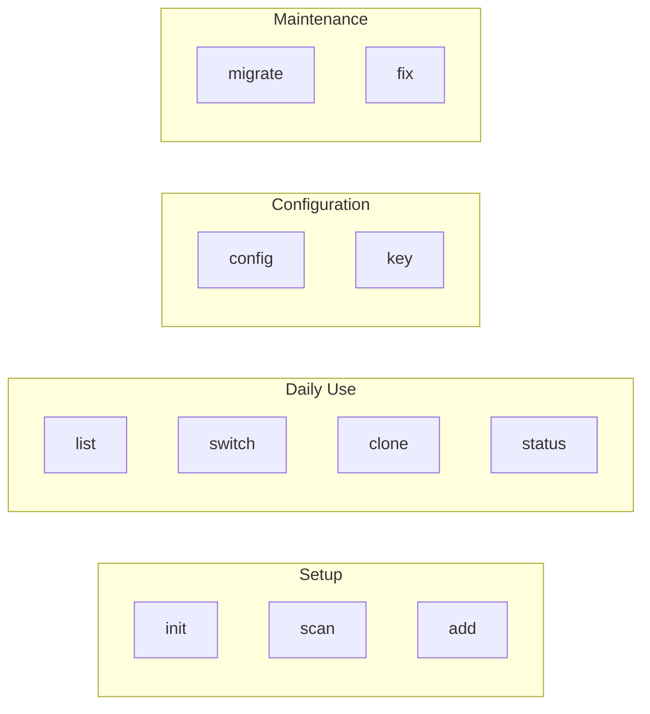
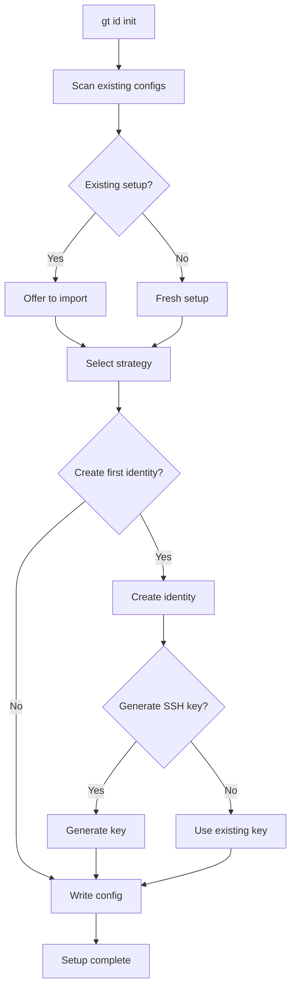
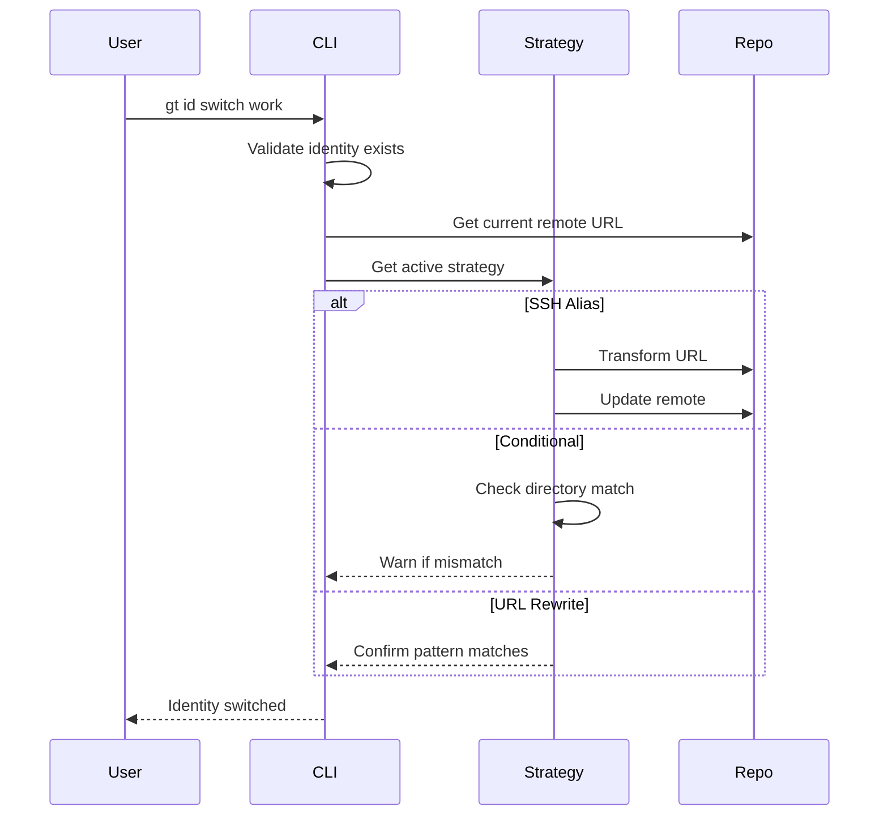
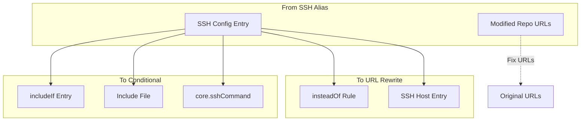

# 003 - CLI Reference

Complete reference for all gt commands, options, and usage patterns.

## Table of Contents

- [Global Options](#global-options)
- [Commands Overview](#commands-overview)
- [gt id init](#gt-init)
- [gt id scan](#gt-scan)
- [gt id add](#gt-add)
- [gt id list](#gt-list)
- [gt id switch](#gt-switch)
- [gt id clone](#gt-clone)
- [gt id config](#gt-config)
- [gt id migrate](#gt-migrate)
- [gt id fix](#gt-fix)
- [gt id key](#gt-key)
- [gt id status](#gt-status)
- [Output Formats](#output-formats)
- [Exit Codes](#exit-codes)

## Global Options

These options are available for all commands:

```
OPTIONS:
    -h, --help              Print help information
    -V, --version           Print version information
    -v, --verbose           Increase verbosity (-v, -vv, -vvv)
    -q, --quiet             Suppress non-error output
    -c, --config <PATH>     Use alternate config file
    -o, --output <FORMAT>   Output format: terminal, json, csv [default: terminal]
        --no-color          Disable colored output
        --dry-run           Show what would be done without making changes
```

## Commands Overview



| Command | Description |
|---------|-------------|
| `init` | Interactive setup wizard |
| `scan` | Detect existing configurations |
| `add` | Add a new identity |
| `list` | List all configured identities |
| `switch` | Switch identity for current repo |
| `clone` | Clone with automatic identity |
| `config` | Get/set configuration values |
| `migrate` | Migrate between strategies |
| `fix` | Fix repository URLs |
| `key` | SSH key management |
| `status` | Show current identity status |

## gt id init

Interactive setup wizard for first-time configuration.

### Synopsis

```bash
gt id init [OPTIONS]
```

### Options

```
OPTIONS:
    --non-interactive       Skip interactive prompts, use defaults
    --strategy <STRATEGY>   Set default strategy: ssh-alias, conditional, url-rewrite
    --force                 Overwrite existing configuration
```

### Description

The `init` command walks you through setting up gt for the first time. It will:

1. Scan for existing SSH and Git configurations
2. Detect any existing identity patterns
3. Recommend a strategy based on your setup
4. Create the gt id configuration file
5. Optionally create your first identity

### Examples

```bash
# Interactive setup
gt id init

# Non-interactive with SSH alias strategy
gt id init --non-interactive --strategy ssh-alias

# Force re-initialization
gt id init --force
```

### Interactive Flow



## gt id scan

Detect and report existing identity configurations.

### Synopsis

```bash
gt id scan [OPTIONS] [PATH]
```

### Options

```
OPTIONS:
    -d, --deep              Deep scan (check all repos in path)
    --ssh-only              Only scan SSH configuration
    --git-only              Only scan Git configuration
    --show-keys             Show SSH key details
```

### Arguments

```
ARGS:
    <PATH>    Path to scan [default: ~]
```

### Description

The `scan` command analyzes your system for existing identity configurations:

- SSH config entries (Host blocks with IdentityFile)
- Git conditional includes
- Git URL rewrite rules (insteadOf)
- Modified repository URLs (SSH alias pattern)
- Existing SSH keys

### Output

```bash
$ gt id scan

SSH Configuration (~/.ssh/config)
=================================
Found 3 identity-related entries:

  Host gt-work.github.com
    Strategy: SSH Alias
    Identity: work
    Provider: GitHub
    Key: ~/.ssh/id_gt_work

  Host gt-personal.github.com
    Strategy: SSH Alias
    Identity: personal
    Provider: GitHub
    Key: ~/.ssh/id_gt_personal

  Host company-gitlab
    Strategy: Custom SSH
    Provider: GitLab (gitlab.company.com)
    Key: ~/.ssh/id_company

Git Configuration (~/.gitconfig)
================================
Found 2 conditional includes:

  [includeIf "gitdir:~/work/"]
    path = ~/.gitconfig.d/work
    User: Work Name <work@company.com>

  [includeIf "gitdir:~/personal/"]
    path = ~/.gitconfig.d/personal
    User: Personal <personal@email.com>

SSH Keys (~/.ssh)
=================
Found 5 SSH keys:
  id_gt_work (ed25519) - matches config
  id_gt_personal (ed25519) - matches config
  id_company (rsa) - matches config
  id_rsa (rsa) - not referenced
  id_ed25519 (ed25519) - default key

Recommendations
===============
Your setup uses: SSH Alias strategy
Detected identities could be imported into gt.
Run 'gt id init' to import existing configuration.
```

### JSON Output

```bash
$ gt id scan --output json

{
  "ssh_config": {
    "path": "/home/user/.ssh/config",
    "entries": [
      {
        "host": "gt-work.github.com",
        "strategy": "ssh_alias",
        "identity": "work",
        "provider": "github",
        "key_path": "/home/user/.ssh/id_gt_work"
      }
    ]
  },
  "git_config": {
    "conditionals": [...],
    "url_rewrites": [...]
  },
  "ssh_keys": [...],
  "recommendations": {
    "detected_strategy": "ssh_alias",
    "importable_identities": ["work", "personal"]
  }
}
```

## gt id add

Add a new identity.

### Synopsis

```bash
gt id add [OPTIONS] <NAME>
```

### Options

```
OPTIONS:
    -e, --email <EMAIL>         Email for this identity
    -n, --user-name <NAME>      Git user.name for this identity
    -p, --provider <PROVIDER>   Provider: github, gitlab, bitbucket, azure, codecommit, custom
    -s, --strategy <STRATEGY>   Strategy override for this identity
    -k, --key <PATH>            Use existing SSH key (skip generation)
    --key-type <TYPE>           SSH key type: ed25519, rsa [default: ed25519]
    --no-key                    Don't generate or associate SSH key
    --host <HOST>               Custom hostname (for self-hosted providers)
```

### Arguments

```
ARGS:
    <NAME>    Identity name (alphanumeric, hyphens allowed)
```

### Description

Creates a new identity with the specified configuration. If no SSH key is specified, generates a new one.

### Examples

```bash
# Add a work identity for GitHub
gt id add work --email work@company.com --provider github

# Add identity with existing key
gt id add personal --email me@email.com --key ~/.ssh/id_personal

# Add identity for self-hosted GitLab
gt id add client --email dev@client.com --provider gitlab --host gitlab.client.com

# Add identity without SSH key (for HTTPS use)
gt id add readonly --email user@email.com --no-key
```

### Validation

Identity names must:
- Start with a letter
- Contain only alphanumeric characters and hyphens
- Be 2-32 characters long
- Not contain the prefix "gt-" (reserved)

## gt id list

List all configured identities.

### Synopsis

```bash
gt id list [OPTIONS]
```

### Options

```
OPTIONS:
    -a, --all               Show all details
    -s, --strategy          Group by strategy
    --show-keys             Include SSH key paths
```

### Output

```bash
$ gt id list

NAME        PROVIDER    EMAIL                   STRATEGY
work        github      work@company.com        ssh-alias
personal    github      me@personal.com         ssh-alias
client      gitlab      dev@client.com          ssh-alias
oss         github      oss@email.com           conditional

Default: work
Active (this repo): personal
```

```bash
$ gt id list --all

work
  Provider:   GitHub (github.com)
  Email:      work@company.com
  User Name:  Work User
  Strategy:   SSH Alias
  SSH Key:    ~/.ssh/id_gt_work
  Created:    2024-01-15
  Repos:      12

personal
  Provider:   GitHub (github.com)
  Email:      me@personal.com
  User Name:  Personal User
  Strategy:   SSH Alias
  SSH Key:    ~/.ssh/id_gt_personal
  Created:    2024-01-10
  Repos:      8
```

## gt id switch

Switch identity for the current repository.

### Synopsis

```bash
gt id switch [OPTIONS] <IDENTITY>
```

### Options

```
OPTIONS:
    -r, --repo <PATH>       Repository path [default: current directory]
    --update-remote         Update remote URL (for SSH alias strategy)
    --no-update-remote      Keep current remote URL
```

### Arguments

```
ARGS:
    <IDENTITY>    Identity to switch to
```

### Description

Switches the identity for a repository. Behavior depends on strategy:

- **SSH Alias**: Updates the remote URL to use the identity hostname
- **Conditional**: Verifies repo is in correct directory, warns if not
- **URL Rewrite**: No repo-level action needed, shows confirmation

### Examples

```bash
# Switch current repo to work identity
gt id switch work

# Switch specific repo
gt id switch personal --repo ~/projects/my-repo

# Switch without updating remote URL
gt id switch work --no-update-remote
```

### Flow



## gt id clone

Clone a repository with automatic identity selection.

### Synopsis

```bash
gt id clone [OPTIONS] <URL> [PATH]
```

### Options

```
OPTIONS:
    -i, --identity <ID>     Identity to use [default: auto-detect or default]
    -s, --strategy <STRAT>  Override strategy for this clone
    --no-transform          Clone with original URL (don't apply identity)
```

### Arguments

```
ARGS:
    <URL>     Repository URL to clone
    <PATH>    Local path for clone [default: repo name]
```

### Description

Clones a repository with automatic identity handling. For SSH alias strategy, transforms the URL. For conditional, clones to appropriate directory. For URL rewrite, verifies rules will apply.

### Examples

```bash
# Clone with auto-detected identity
gt id clone git@github.com:company/repo.git

# Clone with specific identity
gt id clone git@github.com:company/repo.git --identity work

# Clone to specific path
gt id clone git@github.com:user/repo.git ~/projects/repo --identity personal
```

### URL Transformation (SSH Alias)

```
Input:  git@github.com:company/repo.git
Identity: work

Output: git clone git@gt-work.github.com:company/repo.git
```

## gt id config

Get or set configuration values.

### Synopsis

```bash
gt id config [OPTIONS] [KEY] [VALUE]
gt id config --list
gt id config --edit
```

### Options

```
OPTIONS:
    -l, --list              List all configuration
    -e, --edit              Open config in editor
    --global                Operate on global config
    --identity <ID>         Operate on identity-specific config
    --unset                 Remove a configuration key
```

### Arguments

```
ARGS:
    <KEY>       Configuration key (dot notation)
    <VALUE>     Value to set (omit to get current value)
```

### Configuration Keys

```
Global:
    default.identity        Default identity name
    default.strategy        Default strategy
    default.provider        Default provider
    ssh.key_type            Default SSH key type (ed25519, rsa)
    ui.color                Enable colored output
    ui.interactive          Enable interactive prompts
    backup.enabled          Enable config backups
    backup.max_count        Maximum backup files per config

Identity (gt id config --identity <ID>):
    email                   Git user.email
    name                    Git user.name
    provider                Provider name
    strategy                Strategy override
    ssh.key_path            SSH key path
    ssh.key_type            SSH key type
```

### Examples

```bash
# Get default identity
gt id config default.identity

# Set default identity
gt id config default.identity work

# List all config
gt id config --list

# Set identity-specific email
gt id config --identity work email work@newcompany.com

# Open config in editor
gt id config --edit
```

## gt id migrate

Migrate between identity strategies.

### Synopsis

```bash
gt id migrate [OPTIONS] <TARGET_STRATEGY>
```

### Options

```
OPTIONS:
    -i, --identity <ID>     Migrate specific identity only
    --all                   Migrate all identities
    --repos                 Also update repository URLs
    --dry-run               Show migration plan without executing
```

### Arguments

```
ARGS:
    <TARGET_STRATEGY>    Target strategy: ssh-alias, conditional, url-rewrite
```

### Description

Migrates identities from one strategy to another. This involves:

1. Creating new configuration entries for target strategy
2. Optionally updating repository remote URLs
3. Cleaning up old configuration (with confirmation)

### Examples

```bash
# Migrate work identity to conditional includes
gt id migrate conditional --identity work

# Preview migration of all identities
gt id migrate url-rewrite --all --dry-run

# Full migration including repos
gt id migrate ssh-alias --all --repos
```

### Migration Matrix



## gt id fix

Fix repository URLs and configurations.

### Synopsis

```bash
gt id fix [OPTIONS] [PATH]
```

### Options

```
OPTIONS:
    -i, --identity <ID>     Fix using specific identity
    --restore               Restore original URLs (remove identity markers)
    --update                Update to current identity format
    --recursive             Fix all repos in directory tree
    --dry-run               Show what would be changed
```

### Arguments

```
ARGS:
    <PATH>    Repository or directory path [default: current directory]
```

### Description

Fixes repository configurations that may be incorrect or outdated:

- Restores original URLs from modified SSH alias URLs
- Updates outdated URL formats
- Fixes broken remote configurations
- Reconciles identity markers with current config

### Examples

```bash
# Fix current repo
gt id fix

# Restore original URL (remove identity marker)
gt id fix --restore

# Fix all repos in ~/projects
gt id fix ~/projects --recursive --dry-run

# Update to new identity
gt id fix --identity new-work
```

### URL Restoration

```
Current:  git@gt-oldwork.github.com:company/repo.git
Restored: git@github.com:company/repo.git

Current:  git@gt-work.github.com:company/repo.git
Updated:  git@gt-newwork.github.com:company/repo.git
```

## gt id key

SSH key management subcommands.

### Synopsis

```bash
gt id key <SUBCOMMAND>
```

### Subcommands

```
SUBCOMMANDS:
    generate    Generate a new SSH key
    list        List SSH keys
    add         Add existing key to identity
    remove      Remove key from identity
    activate    Add key to SSH agent
    show        Show public key (for adding to provider)
    test        Test key authentication with provider
```

### gt id key generate

```bash
gt id key generate [OPTIONS] <IDENTITY>

OPTIONS:
    -t, --type <TYPE>       Key type: ed25519, rsa [default: ed25519]
    -b, --bits <BITS>       Key bits for RSA [default: 4096]
    -c, --comment <TEXT>    Key comment
    --force                 Overwrite existing key
```

### gt id key list

```bash
gt id key list [OPTIONS]

OPTIONS:
    -a, --all               Show all SSH keys (not just gt)
    --identity <ID>         Filter by identity
```

### gt id key show

```bash
gt id key show <IDENTITY>

# Output (ready to paste into provider):
ssh-ed25519 AAAAC3NzaC1lZDI1NTE5AAAAIG... gt-work@github.com
```

### gt id key test

```bash
gt id key test <IDENTITY>

# Output:
Testing authentication for identity 'work'...
Provider: GitHub (github.com)
Key: ~/.ssh/id_gt_work

SSH Connection: OK
Authentication: OK
Username: work-user
```

## gt id status

Show current identity status.

### Synopsis

```bash
gt id status [OPTIONS]
```

### Options

```
OPTIONS:
    -r, --repo <PATH>       Repository path [default: current directory]
    --all                   Show detailed status
```

### Output

```bash
$ gt id status

Repository: ~/projects/work-project
Remote: git@gt-work.github.com:company/project.git
Identity: work
Strategy: SSH Alias
Provider: GitHub

Git Config:
  user.name:  Work User
  user.email: work@company.com

SSH Key: ~/.ssh/id_gt_work
  Fingerprint: SHA256:abc123...
  Agent: loaded
```

## Output Formats

All commands support multiple output formats via `--output`:

### Terminal (default)

Human-readable formatted output with colors and tables.

### JSON

Machine-readable JSON output:

```bash
gt id list --output json
```

```json
{
  "identities": [
    {
      "name": "work",
      "provider": "github",
      "email": "work@company.com",
      "strategy": "ssh-alias",
      "default": true
    }
  ]
}
```

### CSV

Tabular CSV output for spreadsheet processing:

```bash
gt id list --output csv
```

```csv
name,provider,email,strategy,default
work,github,work@company.com,ssh-alias,true
personal,github,me@email.com,ssh-alias,false
```

## Exit Codes

| Code | Meaning |
|------|---------|
| 0 | Success |
| 1 | General error |
| 2 | Configuration error |
| 3 | Identity not found |
| 4 | Repository not found |
| 5 | SSH key error |
| 6 | Git operation failed |
| 10 | User cancelled |

## Next Steps

Continue to [004-configuration.md](004-configuration.md) for configuration file reference.
