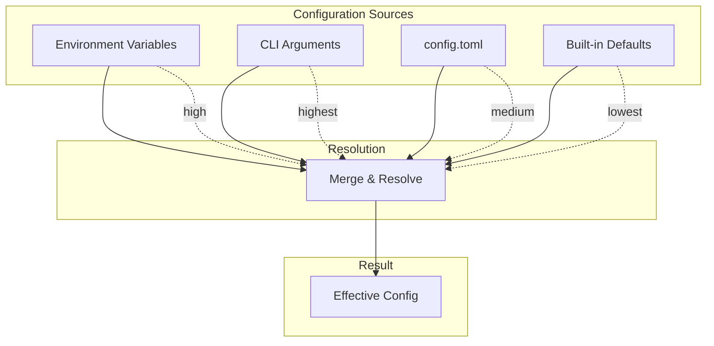
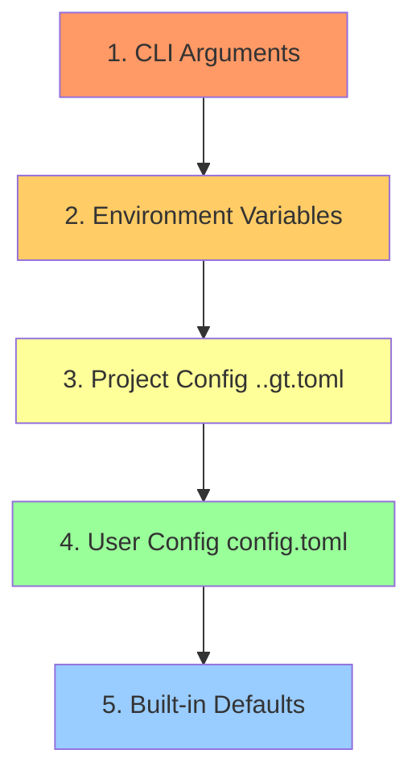

# 004 - Configuration

Complete reference for gt id configuration files, formats, and options.

## Table of Contents

- [Configuration Files](#configuration-files)
- [File Locations](#file-locations)
- [Configuration Format](#configuration-format)
- [Global Settings](#global-settings)
- [Identity Configuration](#identity-configuration)
- [Provider Configuration](#provider-configuration)
- [Strategy Configuration](#strategy-configuration)
- [Environment Variables](#environment-variables)
- [Configuration Precedence](#configuration-precedence)
- [Example Configurations](#example-configurations)

## Configuration Files

gt uses TOML format for all configuration files. The primary configuration is stored in a single file with a well-defined structure.

### Configuration Hierarchy



## File Locations

### Primary Configuration

| Platform | Path |
|----------|------|
| Linux | `~/.config/gt/config.toml` |
| macOS | `~/.config/gt/config.toml` |
| Windows | `%APPDATA%\gt\config.toml` |

### Alternative XDG Location (Linux)

If `$XDG_CONFIG_HOME` is set:
- `$XDG_CONFIG_HOME/gt/config.toml`

### Per-Project Configuration

gt can also read project-specific configuration:
- `..gt.toml` in repository root
- Only identity selection and strategy overrides are allowed

### Custom Location

Override with CLI flag or environment variable:
```bash
gt --config /path/to/config.toml <command>
GITID_CONFIG=/path/to/config.toml gt <command>
```

## Configuration Format

### Complete Schema

```toml
# gt id configuration file
# Version: 1.0

#
# Global defaults
#
[defaults]
identity = "work"               # Default identity name
strategy = "ssh-alias"          # Default strategy: ssh-alias, conditional, url-rewrite
provider = "github"             # Default provider

#
# SSH key generation settings
#
[ssh]
key_type = "ed25519"            # Key type: ed25519, rsa
rsa_bits = 4096                 # RSA key size (if rsa)
key_prefix = "id_gt_"        # Prefix for generated keys
comment_format = "{identity}@{provider}"  # Key comment template

#
# Backup settings
#
[backup]
enabled = true                  # Enable automatic backups
max_count = 2                   # Max backups per file
directory = ""                  # Backup dir (empty = same as original)

#
# UI settings
#
[ui]
color = true                    # Enable colored output
interactive = true              # Enable interactive prompts
progress = true                 # Show progress indicators
editor = ""                     # Editor for config --edit (empty = $EDITOR)

#
# Provider configurations
#
[providers.github]
hostname = "github.com"
ssh_user = "git"
url_pattern = "git@{host}:{owner}/{repo}.git"

[providers.gitlab]
hostname = "gitlab.com"
ssh_user = "git"
url_pattern = "git@{host}:{owner}/{repo}.git"

[providers.bitbucket]
hostname = "bitbucket.org"
ssh_user = "git"
url_pattern = "git@{host}:{owner}/{repo}.git"

[providers.azure]
hostname = "dev.azure.com"
ssh_user = "git"
url_pattern = "git@ssh.{host}:{org}/{project}/_git/{repo}"

# Custom provider example
[providers.company]
hostname = "git.company.com"
ssh_user = "git"
url_pattern = "git@{host}:{owner}/{repo}.git"

#
# Identity configurations
#
[identities.work]
email = "developer@company.com"
name = "Developer Name"
provider = "github"
strategy = "ssh-alias"          # Strategy override (optional)

[identities.work.ssh]
key_path = "~/.ssh/id_gt_work"
key_type = "ed25519"

# Optional: Additional provider-specific settings
[identities.work.github]
username = "dev-work"

[identities.personal]
email = "personal@email.com"
name = "Personal Name"
provider = "github"

[identities.personal.ssh]
key_path = "~/.ssh/id_gt_personal"

[identities.client]
email = "dev@client.com"
name = "Developer"
provider = "company"            # Uses custom provider defined above
strategy = "conditional"

[identities.client.ssh]
key_path = "~/.ssh/id_client"

[identities.client.conditional]
directory = "~/client-work"     # For conditional strategy

#
# Strategy-specific global settings
#
[strategy.ssh_alias]
prefix = "gt"                # Hostname prefix: gt-{identity}.{provider}
include_user = true             # Include User directive in SSH config

[strategy.conditional]
config_dir = "~/.gitconfig.d"   # Directory for include files
use_ssh_command = true          # Use core.sshCommand instead of SSH config

[strategy.url_rewrite]
scope = "organization"          # Default scope: organization, user, provider
```

## Global Settings

### [defaults]

| Key | Type | Default | Description |
|-----|------|---------|-------------|
| `identity` | string | (none) | Default identity when none specified |
| `strategy` | string | `"ssh-alias"` | Default strategy for new identities |
| `provider` | string | `"github"` | Default provider for new identities |

### [ssh]

| Key | Type | Default | Description |
|-----|------|---------|-------------|
| `key_type` | string | `"ed25519"` | SSH key type: `ed25519`, `rsa` |
| `rsa_bits` | integer | `4096` | RSA key size |
| `key_prefix` | string | `"id_gt_"` | Prefix for generated key files |
| `comment_format` | string | `"{identity}@{provider}"` | Key comment template |

### [backup]

| Key | Type | Default | Description |
|-----|------|---------|-------------|
| `enabled` | boolean | `true` | Enable automatic backups |
| `max_count` | integer | `2` | Maximum backup files per config file |
| `directory` | string | `""` | Backup directory (empty = same as original) |

### [ui]

| Key | Type | Default | Description |
|-----|------|---------|-------------|
| `color` | boolean | `true` | Enable colored output |
| `interactive` | boolean | `true` | Enable interactive prompts |
| `progress` | boolean | `true` | Show progress indicators |
| `editor` | string | `""` | Editor command (empty = use $EDITOR) |

## Identity Configuration

Each identity is defined under `[identities.<name>]`:

### Required Fields

| Key | Type | Description |
|-----|------|-------------|
| `email` | string | Git user.email |
| `name` | string | Git user.name |
| `provider` | string | Provider name (must exist in [providers]) |

### Optional Fields

| Key | Type | Default | Description |
|-----|------|---------|-------------|
| `strategy` | string | global default | Strategy override |

### SSH Subsection [identities.<name>.ssh]

| Key | Type | Default | Description |
|-----|------|---------|-------------|
| `key_path` | string | auto-generated | Path to SSH private key |
| `key_type` | string | global default | Key type for this identity |

### Conditional Subsection [identities.<name>.conditional]

| Key | Type | Description |
|-----|------|-------------|
| `directory` | string | Base directory for this identity |

### Provider-Specific Subsection [identities.<name>.<provider>]

| Key | Type | Description |
|-----|------|-------------|
| `username` | string | Provider username |
| `organizations` | array | Associated organizations |

## Provider Configuration

### Built-in Providers

gt includes built-in configurations for:

- `github` - GitHub.com
- `gitlab` - GitLab.com
- `bitbucket` - Bitbucket.org
- `azure` - Azure DevOps
- `codecommit` - AWS CodeCommit

### Custom Providers

Define custom providers under `[providers.<name>]`:

```toml
[providers.company]
hostname = "git.company.com"
ssh_user = "git"
url_pattern = "git@{host}:{owner}/{repo}.git"
```

### URL Pattern Variables

| Variable | Description |
|----------|-------------|
| `{host}` | Provider hostname |
| `{owner}` | Repository owner/organization |
| `{repo}` | Repository name |
| `{project}` | Project name (Azure DevOps) |
| `{org}` | Organization name (Azure DevOps) |

## Strategy Configuration

### [strategy.ssh_alias]

| Key | Type | Default | Description |
|-----|------|---------|-------------|
| `prefix` | string | `"gt"` | Hostname prefix |
| `include_user` | boolean | `true` | Include User directive |

Generated hostname format: `{prefix}-{identity}.{provider}`

Example: `gt-work.github.com`

### [strategy.conditional]

| Key | Type | Default | Description |
|-----|------|---------|-------------|
| `config_dir` | string | `"~/.gitconfig.d"` | Directory for include files |
| `use_ssh_command` | boolean | `true` | Use core.sshCommand |

### [strategy.url_rewrite]

| Key | Type | Default | Description |
|-----|------|---------|-------------|
| `scope` | string | `"organization"` | Default matching scope |

Scope options:
- `organization` - Match organization/owner in URL
- `user` - Match user in URL
- `provider` - Match entire provider

## Environment Variables

| Variable | Description | Overrides |
|----------|-------------|-----------|
| `GITID_CONFIG` | Config file path | CLI --config |
| `GITID_IDENTITY` | Default identity | defaults.identity |
| `GITID_STRATEGY` | Default strategy | defaults.strategy |
| `GITID_NO_COLOR` | Disable colors | ui.color |
| `GITID_QUIET` | Suppress output | CLI --quiet |
| `GITID_DEBUG` | Enable debug output | - |

## Configuration Precedence

Configuration values are resolved in this order (highest to lowest):



## Example Configurations

### Minimal Configuration

```toml
[defaults]
identity = "personal"

[identities.personal]
email = "me@email.com"
name = "My Name"
provider = "github"
```

### Multi-Account GitHub

```toml
[defaults]
identity = "work"
strategy = "ssh-alias"

[identities.work]
email = "dev@company.com"
name = "Developer"
provider = "github"

[identities.work.github]
username = "dev-company"

[identities.personal]
email = "personal@email.com"
name = "My Name"
provider = "github"

[identities.personal.github]
username = "my-username"
```

### Multi-Provider Setup

```toml
[defaults]
identity = "work"
strategy = "ssh-alias"

[identities.work]
email = "dev@company.com"
name = "Developer"
provider = "github"

[identities.gitlab]
email = "dev@company.com"
name = "Developer"
provider = "gitlab"

[identities.client]
email = "contractor@client.com"
name = "Contractor"
provider = "company"

[providers.company]
hostname = "gitlab.client.com"
ssh_user = "git"
url_pattern = "git@{host}:{owner}/{repo}.git"
```

### Directory-Based (Conditional)

```toml
[defaults]
strategy = "conditional"

[identities.work]
email = "dev@company.com"
name = "Developer"
provider = "github"

[identities.work.conditional]
directory = "~/work"

[identities.personal]
email = "me@email.com"
name = "My Name"
provider = "github"

[identities.personal.conditional]
directory = "~/personal"

[identities.oss]
email = "oss@email.com"
name = "OSS Contributor"
provider = "github"

[identities.oss.conditional]
directory = "~/opensource"
```

### URL Rewrite Strategy

```toml
[defaults]
strategy = "url-rewrite"

[identities.work]
email = "dev@company.com"
name = "Developer"
provider = "github"

[identities.work.url_rewrite]
# Rewrite any URL containing 'company-org'
patterns = ["company-org/"]

[identities.personal]
email = "me@email.com"
name = "My Name"
provider = "github"

[identities.personal.url_rewrite]
# Rewrite URLs for personal username
patterns = ["my-username/"]
```

### Project-Level Override (..gt.toml)

```toml
# ..gt.toml in repository root
identity = "client"

# Only identity selection is allowed in project config
# Full identity definition must be in user config
```

## Validation

gt validates configuration on load:

1. **Required fields**: All required fields must be present
2. **Provider references**: Referenced providers must exist
3. **Path expansion**: Paths are expanded (`~`, `$HOME`)
4. **Type checking**: Values must match expected types
5. **Strategy validation**: Strategy-specific fields are validated

### Validation Errors

```bash
$ gt id config --validate

Configuration validation failed:
  - identities.work: missing required field 'email'
  - identities.client.provider: unknown provider 'acme'
  - strategy.conditional.config_dir: directory does not exist
```

## Next Steps

Continue to [005-security.md](005-security.md) for security considerations.
