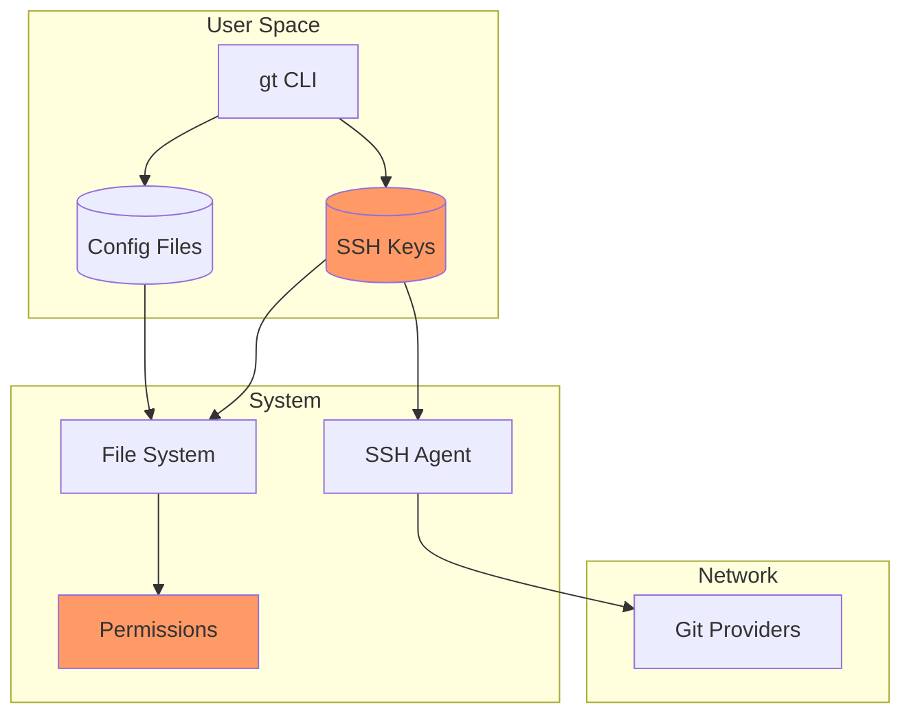
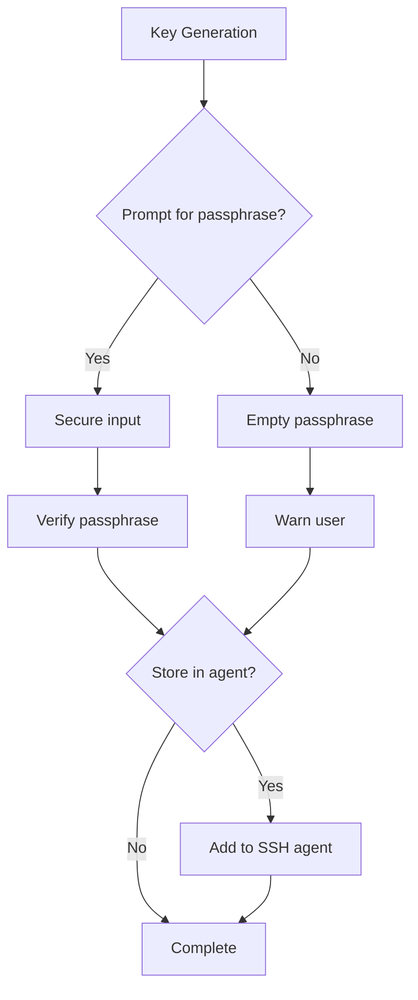
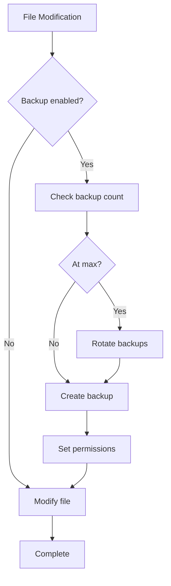
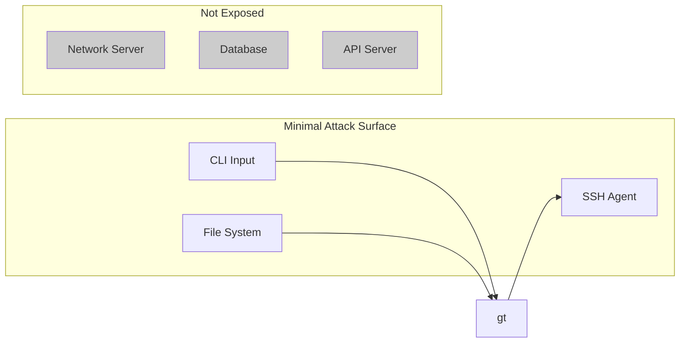

# 005 - Security Considerations

This document covers the security model, best practices, and implementation details for gt.

## Table of Contents

- [Security Model](#security-model)
- [SSH Key Security](#ssh-key-security)
- [File Permissions](#file-permissions)
- [Configuration Security](#configuration-security)
- [Backup Security](#backup-security)
- [Secret Handling](#secret-handling)
- [Threat Model](#threat-model)
- [Security Best Practices](#security-best-practices)
- [Audit Logging](#audit-logging)

## Security Model

gt operates with the principle of least privilege and defense in depth.

### Security Boundaries



### Trust Levels

| Component | Trust Level | Rationale |
|-----------|-------------|-----------|
| SSH Private Keys | Highest | Must never be exposed |
| gt Config | High | Contains identity mappings |
| SSH Config | High | Controls authentication |
| Git Config | Medium | User preferences |
| Repository URLs | Low | Public information |

## SSH Key Security

### Key Generation

gt generates SSH keys using `ssh-keygen` with secure defaults:

```rust
pub struct KeyGenOptions {
    key_type: KeyType,      // ed25519 preferred
    bits: Option<u32>,      // 4096 for RSA
    comment: String,
    passphrase: Option<SecureString>,
}

impl KeyGenerator {
    pub fn generate(&self, opts: KeyGenOptions) -> Result<KeyPair> {
        // Use system ssh-keygen for security
        let mut cmd = Command::new("ssh-keygen");

        cmd.args([
            "-t", opts.key_type.as_str(),
            "-C", &opts.comment,
            "-f", &key_path,
        ]);

        // Add bits for RSA
        if let (KeyType::Rsa, Some(bits)) = (&opts.key_type, opts.bits) {
            cmd.args(["-b", &bits.to_string()]);
        }

        // Handle passphrase securely
        if let Some(passphrase) = opts.passphrase {
            cmd.args(["-N", passphrase.expose_secret()]);
        } else {
            cmd.args(["-N", ""]); // Empty passphrase (user's choice)
        }

        // Execute and verify
        let output = cmd.output()?;
        self.verify_key_created(&key_path)?;
        self.set_permissions(&key_path)?;

        Ok(KeyPair::load(&key_path)?)
    }
}
```

### Key Type Recommendations

| Type | Bits | Security Level | Recommendation |
|------|------|----------------|----------------|
| ed25519 | 256 | High | **Preferred** |
| RSA | 4096 | High | Legacy systems |
| RSA | 2048 | Medium | Not recommended |
| DSA | any | Low | Never use |
| ECDSA | any | Medium | Avoid if possible |

### Passphrase Handling



gt supports:
- Interactive passphrase entry (secure terminal input)
- SSH agent integration for passphrase-protected keys
- Passphrase-less keys (with warning)

## File Permissions

### Required Permissions

| File | Unix Mode | Windows | Description |
|------|-----------|---------|-------------|
| SSH Private Key | 0600 | Owner only | Critical - authentication |
| SSH Public Key | 0644 | Read all | Public information |
| ~/.ssh/config | 0600 | Owner only | Authentication config |
| ~/.gitconfig | 0644 | Read all | User preferences |
| gt id config.toml | 0600 | Owner only | Identity mappings |
| Backup files | 0600 | Owner only | May contain sensitive data |

### Permission Setting Implementation

```rust
use std::os::unix::fs::PermissionsExt;

pub fn set_secure_permissions(path: &Path, mode: u32) -> Result<()> {
    #[cfg(unix)]
    {
        let perms = std::fs::Permissions::from_mode(mode);
        std::fs::set_permissions(path, perms)?;
    }

    #[cfg(windows)]
    {
        // Windows uses ACLs, not mode bits
        use windows_permissions::*;
        set_owner_only_acl(path)?;
    }

    Ok(())
}

pub fn verify_permissions(path: &Path) -> Result<PermissionStatus> {
    #[cfg(unix)]
    {
        let metadata = std::fs::metadata(path)?;
        let mode = metadata.permissions().mode();

        // Check for world/group readable
        if mode & 0o077 != 0 {
            return Ok(PermissionStatus::TooPermissive(mode));
        }

        Ok(PermissionStatus::Secure)
    }

    #[cfg(windows)]
    {
        // Check Windows ACLs
        check_windows_acl(path)
    }
}
```

### Permission Verification

gt verifies permissions on sensitive files:

```rust
pub fn verify_ssh_security() -> Vec<SecurityWarning> {
    let mut warnings = Vec::new();

    // Check SSH directory
    let ssh_dir = dirs::home_dir().unwrap().join(".ssh");
    if let Err(e) = verify_permissions(&ssh_dir) {
        warnings.push(SecurityWarning::SshDirectory(e));
    }

    // Check all private keys
    for key in find_private_keys(&ssh_dir)? {
        if let PermissionStatus::TooPermissive(mode) = verify_permissions(&key)? {
            warnings.push(SecurityWarning::KeyPermissions {
                path: key,
                mode,
                required: 0o600,
            });
        }
    }

    // Check SSH config
    let ssh_config = ssh_dir.join("config");
    if ssh_config.exists() {
        if let PermissionStatus::TooPermissive(mode) = verify_permissions(&ssh_config)? {
            warnings.push(SecurityWarning::ConfigPermissions {
                path: ssh_config,
                mode,
            });
        }
    }

    warnings
}
```

## Configuration Security

### Sensitive Data Handling

gt id configuration does not store:
- Passwords
- API tokens
- Private key contents
- Passphrases

Only file paths and identity metadata are stored.

### Configuration Validation

```rust
pub fn validate_config_security(config: &Config) -> Result<Vec<SecurityWarning>> {
    let mut warnings = Vec::new();

    // Check for embedded secrets
    for identity in &config.identities {
        if looks_like_secret(&identity.email) {
            warnings.push(SecurityWarning::PossibleSecret {
                field: "email",
                identity: identity.name.clone(),
            });
        }

        // Verify key paths exist and are secure
        if let Some(key_path) = &identity.ssh.key_path {
            let expanded = expand_path(key_path)?;
            if !expanded.exists() {
                warnings.push(SecurityWarning::KeyNotFound {
                    identity: identity.name.clone(),
                    path: expanded,
                });
            } else {
                verify_key_permissions(&expanded, &mut warnings)?;
            }
        }
    }

    Ok(warnings)
}
```

### Secure Config Loading

```rust
pub fn load_config_secure(path: &Path) -> Result<Config> {
    // Verify file exists
    if !path.exists() {
        return Err(Error::ConfigNotFound(path.to_owned()));
    }

    // Verify permissions
    if let PermissionStatus::TooPermissive(mode) = verify_permissions(path)? {
        log::warn!(
            "Config file {} has insecure permissions {:o}, should be 0600",
            path.display(),
            mode
        );
    }

    // Load and parse
    let contents = std::fs::read_to_string(path)?;
    let config: Config = toml::from_str(&contents)?;

    // Validate security
    let warnings = validate_config_security(&config)?;
    for warning in warnings {
        log::warn!("{}", warning);
    }

    Ok(config)
}
```

## Backup Security

### Backup Strategy



### Backup Implementation

```rust
pub struct BackupManager {
    max_backups: usize,
    backup_dir: Option<PathBuf>,
}

impl BackupManager {
    pub fn create_backup(&self, original: &Path) -> Result<PathBuf> {
        let backup_dir = self.backup_dir.as_ref()
            .map(|d| d.clone())
            .unwrap_or_else(|| original.parent().unwrap().to_owned());

        let timestamp = chrono::Utc::now().format("%Y%m%d_%H%M%S");
        let backup_name = format!(
            "{}.{}.bak",
            original.file_name().unwrap().to_str().unwrap(),
            timestamp
        );
        let backup_path = backup_dir.join(&backup_name);

        // Copy file
        std::fs::copy(original, &backup_path)?;

        // Set secure permissions
        set_secure_permissions(&backup_path, 0o600)?;

        // Rotate old backups
        self.rotate_backups(original, &backup_dir)?;

        Ok(backup_path)
    }

    fn rotate_backups(&self, original: &Path, backup_dir: &Path) -> Result<()> {
        let original_name = original.file_name().unwrap().to_str().unwrap();
        let pattern = format!("{}.*.bak", original_name);

        let mut backups: Vec<_> = glob::glob(&backup_dir.join(&pattern).to_string_lossy())?
            .filter_map(|e| e.ok())
            .collect();

        // Sort by modification time (newest first)
        backups.sort_by(|a, b| {
            b.metadata().unwrap().modified().unwrap()
                .cmp(&a.metadata().unwrap().modified().unwrap())
        });

        // Remove excess backups
        for backup in backups.into_iter().skip(self.max_backups) {
            std::fs::remove_file(&backup)?;
            log::debug!("Removed old backup: {}", backup.display());
        }

        Ok(())
    }
}
```

## Secret Handling

### Secure String Type

For any sensitive data that must be held in memory:

```rust
use secrecy::{Secret, ExposeSecret, Zeroize};

pub struct SecureString(Secret<String>);

impl SecureString {
    pub fn new(value: String) -> Self {
        Self(Secret::new(value))
    }

    pub fn expose_secret(&self) -> &str {
        self.0.expose_secret()
    }
}

impl Drop for SecureString {
    fn drop(&mut self) {
        // Memory is automatically zeroized by secrecy crate
    }
}
```

### Secure Input

```rust
use dialoguer::Password;

pub fn prompt_passphrase(prompt: &str) -> Result<SecureString> {
    let passphrase = Password::new()
        .with_prompt(prompt)
        .with_confirmation("Confirm passphrase", "Passphrases don't match")
        .interact()?;

    Ok(SecureString::new(passphrase))
}
```

## Threat Model

### Threats and Mitigations

| Threat | Impact | Mitigation |
|--------|--------|------------|
| SSH key theft | High | File permissions, passphrase |
| Config tampering | Medium | Permissions, validation |
| Man-in-the-middle | High | SSH host key verification |
| Local privilege escalation | High | No sudo/admin required |
| Memory inspection | Medium | Secure string handling |
| Backup exposure | Medium | Backup permissions, rotation |

### Attack Surface



gt is designed with minimal attack surface:
- No network server
- No database
- No external API calls
- No elevated privileges required
- File system access is limited to known paths

## Security Best Practices

### For Users

1. **Use passphrases on SSH keys**
   ```bash
   gt id key generate work
   # Enter a strong passphrase when prompted
   ```

2. **Use SSH agent for convenience**
   ```bash
   gt id key activate work
   # Key is added to agent, passphrase cached
   ```

3. **Verify permissions periodically**
   ```bash
   gt id scan --show-keys
   # Check for permission warnings
   ```

4. **Use ed25519 keys**
   ```bash
   gt id config ssh.key_type ed25519
   ```

5. **Review backup files**
   ```bash
   ls -la ~/.ssh/*.bak ~/.config/gt/*.bak
   ```

### For Implementation

1. **Never log secrets**
   ```rust
   // BAD
   log::debug!("Passphrase: {}", passphrase);

   // GOOD
   log::debug!("Passphrase: [REDACTED]");
   ```

2. **Validate all input**
   ```rust
   pub fn validate_identity_name(name: &str) -> Result<()> {
       if name.len() < 2 || name.len() > 32 {
           return Err(Error::InvalidIdentityName("length must be 2-32"));
       }
       if !name.chars().all(|c| c.is_alphanumeric() || c == '-') {
           return Err(Error::InvalidIdentityName("invalid characters"));
       }
       if name.contains("gt-") {
           return Err(Error::InvalidIdentityName("reserved prefix"));
       }
       Ok(())
   }
   ```

3. **Use secure defaults**
   ```rust
   impl Default for SshConfig {
       fn default() -> Self {
           Self {
               key_type: KeyType::Ed25519,
               rsa_bits: 4096,
               // ...
           }
       }
   }
   ```

4. **Fail securely**
   ```rust
   // On permission error, don't proceed
   if !verify_permissions(&key_path)?.is_secure() {
       return Err(Error::InsecurePermissions(key_path));
   }
   ```

## Audit Logging

### What is Logged

gt logs security-relevant events:

| Event | Level | Information |
|-------|-------|-------------|
| Key generation | Info | Identity, key type, path |
| Key activation | Info | Identity, agent status |
| Config change | Info | Changed fields (not values) |
| Permission warning | Warn | Path, current vs required |
| Authentication test | Info | Provider, success/failure |

### What is NOT Logged

- Passphrase content
- Private key content
- Full file contents
- User input before validation

### Log Implementation

```rust
pub fn log_security_event(event: SecurityEvent) {
    match event {
        SecurityEvent::KeyGenerated { identity, key_type, path } => {
            log::info!(
                "SSH key generated: identity={}, type={}, path={}",
                identity, key_type, path.display()
            );
        }
        SecurityEvent::PermissionWarning { path, mode, required } => {
            log::warn!(
                "Insecure permissions: path={}, mode={:o}, required={:o}",
                path.display(), mode, required
            );
        }
        SecurityEvent::ConfigModified { fields } => {
            log::info!(
                "Configuration modified: fields=[{}]",
                fields.join(", ")
            );
        }
    }
}
```

## Next Steps

Continue to [006-cross-platform.md](006-cross-platform.md) for cross-platform compatibility details.
