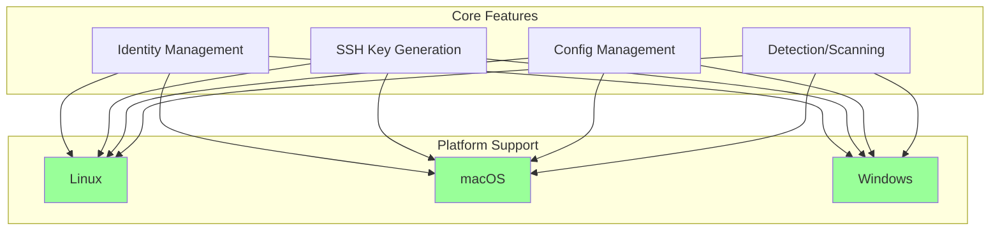

# 006 - Cross-Platform Compatibility

This document covers platform-specific considerations for Linux, macOS, and Windows.

## Table of Contents

- [Platform Overview](#platform-overview)
- [Path Handling](#path-handling)
- [File Permissions](#file-permissions)
- [SSH Configuration](#ssh-configuration)
- [Git Configuration](#git-configuration)
- [Command Execution](#command-execution)
- [Environment Variables](#environment-variables)
- [Platform Detection](#platform-detection)
- [Testing Strategy](#testing-strategy)

## Platform Overview

gt supports three major platforms with varying characteristics:

| Feature | Linux | macOS | Windows |
|---------|-------|-------|---------|
| Path separator | `/` | `/` | `\` (accepts `/`) |
| Home directory | `$HOME` | `$HOME` | `%USERPROFILE%` |
| SSH location | `~/.ssh` | `~/.ssh` | `%USERPROFILE%\.ssh` |
| Permissions | Unix mode | Unix mode | ACLs |
| Line endings | LF | LF | CRLF |
| Shell | bash/zsh | zsh/bash | PowerShell/cmd |

### Platform Support Matrix



## Path Handling

### Home Directory Detection

```rust
use std::path::PathBuf;

pub fn home_dir() -> Result<PathBuf> {
    // Use dirs crate for reliable cross-platform home detection
    dirs::home_dir().ok_or(Error::HomeNotFound)
}

pub fn config_dir() -> Result<PathBuf> {
    // Linux/macOS: ~/.config/gt
    // Windows: %APPDATA%\gt
    dirs::config_dir()
        .map(|p| p.join("gt"))
        .ok_or(Error::ConfigDirNotFound)
}

pub fn ssh_dir() -> Result<PathBuf> {
    // All platforms: ~/. ssh (or %USERPROFILE%\.ssh on Windows)
    home_dir().map(|h| h.join(".ssh"))
}
```

### Path Normalization

```rust
use std::path::{Path, PathBuf};

pub fn normalize_path(path: &Path) -> PathBuf {
    // Expand ~ to home directory
    let expanded = if path.starts_with("~") {
        let home = home_dir().expect("home directory");
        home.join(path.strip_prefix("~").unwrap())
    } else {
        path.to_owned()
    };

    // Normalize separators (Windows accepts both)
    // Use forward slash internally for consistency
    #[cfg(windows)]
    {
        let s = expanded.to_string_lossy().replace('\\', "/");
        PathBuf::from(s)
    }

    #[cfg(not(windows))]
    {
        expanded
    }
}

pub fn display_path(path: &Path) -> String {
    // Show native separators for user display
    #[cfg(windows)]
    {
        path.to_string_lossy().replace('/', "\\")
    }

    #[cfg(not(windows))]
    {
        path.to_string_lossy().into_owned()
    }
}
```

### SSH Path Formats

SSH on Windows requires specific path formats:

```rust
pub fn ssh_path_format(path: &Path) -> String {
    #[cfg(windows)]
    {
        // SSH on Windows needs forward slashes
        // and handles C:/Users/... format
        let s = path.to_string_lossy();

        // Convert backslashes
        let normalized = s.replace('\\', "/");

        // Handle drive letters: C:/Users -> /c/Users (for Git Bash)
        // But OpenSSH uses C:/Users directly
        normalized
    }

    #[cfg(not(windows))]
    {
        path.to_string_lossy().into_owned()
    }
}
```

## File Permissions

### Unix Permissions (Linux/macOS)

```rust
#[cfg(unix)]
mod unix_perms {
    use std::os::unix::fs::PermissionsExt;
    use std::path::Path;
    use std::fs;

    pub fn set_permissions(path: &Path, mode: u32) -> Result<()> {
        let perms = fs::Permissions::from_mode(mode);
        fs::set_permissions(path, perms)?;
        Ok(())
    }

    pub fn check_permissions(path: &Path, required: u32) -> Result<bool> {
        let metadata = fs::metadata(path)?;
        let mode = metadata.permissions().mode();

        // Check only permission bits (ignore file type bits)
        let perm_bits = mode & 0o777;

        // For 0600, ensure no group/world access
        let too_permissive = perm_bits & !required;
        Ok(too_permissive == 0)
    }

    pub fn fix_permissions(path: &Path, required: u32) -> Result<()> {
        let metadata = fs::metadata(path)?;
        let current = metadata.permissions().mode() & 0o777;

        if current != required {
            log::info!(
                "Fixing permissions on {}: {:o} -> {:o}",
                path.display(),
                current,
                required
            );
            set_permissions(path, required)?;
        }

        Ok(())
    }
}
```

### Windows ACLs

```rust
#[cfg(windows)]
mod windows_perms {
    use std::path::Path;

    pub fn set_owner_only(path: &Path) -> Result<()> {
        // Use icacls to set permissions
        // icacls "path" /inheritance:r /grant:r "%USERNAME%:F"

        let output = std::process::Command::new("icacls")
            .arg(path)
            .args(["/inheritance:r"])  // Remove inherited permissions
            .output()?;

        if !output.status.success() {
            return Err(Error::PermissionSetFailed(path.to_owned()));
        }

        let username = std::env::var("USERNAME")?;
        let output = std::process::Command::new("icacls")
            .arg(path)
            .args(["/grant:r", &format!("{}:F", username)])
            .output()?;

        if !output.status.success() {
            return Err(Error::PermissionSetFailed(path.to_owned()));
        }

        Ok(())
    }

    pub fn check_owner_only(path: &Path) -> Result<bool> {
        // Check if only owner has access
        // Parse icacls output to verify

        let output = std::process::Command::new("icacls")
            .arg(path)
            .output()?;

        let stdout = String::from_utf8_lossy(&output.stdout);

        // Should only have owner with full control
        // Complex ACL parsing needed for full verification
        Ok(stdout.lines().count() <= 3)  // Simplified check
    }
}
```

### Cross-Platform Permission API

```rust
pub fn set_secure_permissions(path: &Path) -> Result<()> {
    #[cfg(unix)]
    {
        unix_perms::set_permissions(path, 0o600)
    }

    #[cfg(windows)]
    {
        windows_perms::set_owner_only(path)
    }
}

pub fn verify_secure_permissions(path: &Path) -> Result<PermissionStatus> {
    #[cfg(unix)]
    {
        if unix_perms::check_permissions(path, 0o600)? {
            Ok(PermissionStatus::Secure)
        } else {
            Ok(PermissionStatus::TooPermissive)
        }
    }

    #[cfg(windows)]
    {
        if windows_perms::check_owner_only(path)? {
            Ok(PermissionStatus::Secure)
        } else {
            Ok(PermissionStatus::TooPermissive)
        }
    }
}
```

## SSH Configuration

### SSH Config Locations

```rust
pub fn ssh_config_path() -> PathBuf {
    // Same on all platforms: ~/.ssh/config
    ssh_dir().join("config")
}

pub fn ssh_known_hosts_path() -> PathBuf {
    ssh_dir().join("known_hosts")
}
```

### SSH Agent Detection

```rust
pub fn detect_ssh_agent() -> Result<AgentStatus> {
    #[cfg(unix)]
    {
        // Check SSH_AUTH_SOCK
        if let Ok(sock) = std::env::var("SSH_AUTH_SOCK") {
            if Path::new(&sock).exists() {
                return Ok(AgentStatus::Running);
            }
        }
        Ok(AgentStatus::NotRunning)
    }

    #[cfg(windows)]
    {
        // Check if OpenSSH agent service is running
        let output = std::process::Command::new("sc")
            .args(["query", "ssh-agent"])
            .output()?;

        let stdout = String::from_utf8_lossy(&output.stdout);
        if stdout.contains("RUNNING") {
            Ok(AgentStatus::Running)
        } else {
            Ok(AgentStatus::NotRunning)
        }
    }
}

pub fn add_key_to_agent(key_path: &Path, passphrase: Option<&str>) -> Result<()> {
    let mut cmd = std::process::Command::new("ssh-add");
    cmd.arg(ssh_path_format(key_path));

    // On Windows, ssh-add may need to run in a specific way
    #[cfg(windows)]
    {
        // Ensure we're using OpenSSH's ssh-add, not PuTTY's
        cmd = std::process::Command::new("ssh-add");
    }

    if let Some(pass) = passphrase {
        // Use SSH_ASKPASS for non-interactive passphrase
        // This is complex and platform-specific
        // Consider using expect or pty on Unix
        // On Windows, may need different approach
    }

    let output = cmd.output()?;
    if output.status.success() {
        Ok(())
    } else {
        Err(Error::SshAgentAddFailed(
            String::from_utf8_lossy(&output.stderr).into_owned()
        ))
    }
}
```

### SSH Config Writing

```rust
pub fn write_ssh_config(entries: &[SshHostEntry]) -> Result<()> {
    let config_path = ssh_config_path();

    // Read existing config
    let existing = if config_path.exists() {
        std::fs::read_to_string(&config_path)?
    } else {
        String::new()
    };

    // Parse and merge
    let mut parser = SshConfigParser::new();
    let mut config = parser.parse(&existing)?;

    for entry in entries {
        config.upsert_host(entry);
    }

    // Write with platform-appropriate line endings
    let content = config.to_string();
    let content = normalize_line_endings(&content);

    std::fs::write(&config_path, content)?;
    set_secure_permissions(&config_path)?;

    Ok(())
}

fn normalize_line_endings(content: &str) -> String {
    // Always use LF for SSH config (even on Windows)
    // OpenSSH handles this correctly
    content.replace("\r\n", "\n")
}
```

## Git Configuration

### Git Config Locations

```rust
pub fn git_global_config_path() -> PathBuf {
    #[cfg(unix)]
    {
        home_dir().join(".gitconfig")
    }

    #[cfg(windows)]
    {
        // Git on Windows checks multiple locations
        // Primary: %USERPROFILE%\.gitconfig
        home_dir().join(".gitconfig")
    }
}

pub fn git_system_config_path() -> Option<PathBuf> {
    #[cfg(unix)]
    {
        Some(PathBuf::from("/etc/gitconfig"))
    }

    #[cfg(windows)]
    {
        // Usually in Git installation directory
        // C:\Program Files\Git\etc\gitconfig
        std::env::var("PROGRAMFILES")
            .ok()
            .map(|p| PathBuf::from(p).join("Git").join("etc").join("gitconfig"))
    }
}
```

### Git Command Execution

```rust
pub fn git_command() -> std::process::Command {
    let mut cmd = std::process::Command::new("git");

    #[cfg(windows)]
    {
        // On Windows, ensure we don't open a console window
        use std::os::windows::process::CommandExt;
        const CREATE_NO_WINDOW: u32 = 0x08000000;
        cmd.creation_flags(CREATE_NO_WINDOW);
    }

    cmd
}

pub fn run_git<I, S>(args: I) -> Result<String>
where
    I: IntoIterator<Item = S>,
    S: AsRef<std::ffi::OsStr>,
{
    let output = git_command()
        .args(args)
        .output()?;

    if output.status.success() {
        Ok(String::from_utf8_lossy(&output.stdout).trim().to_string())
    } else {
        Err(Error::GitCommandFailed(
            String::from_utf8_lossy(&output.stderr).into_owned()
        ))
    }
}
```

## Command Execution

### SSH-keygen

```rust
pub fn ssh_keygen_command() -> std::process::Command {
    std::process::Command::new("ssh-keygen")
}

pub fn generate_ssh_key(
    key_path: &Path,
    key_type: KeyType,
    comment: &str,
) -> Result<()> {
    let mut cmd = ssh_keygen_command();

    cmd.args([
        "-t", key_type.as_str(),
        "-C", comment,
        "-f", &ssh_path_format(key_path),
        "-N", "",  // Empty passphrase (or handle separately)
    ]);

    if key_type == KeyType::Rsa {
        cmd.args(["-b", "4096"]);
    }

    let output = cmd.output()?;

    if output.status.success() {
        // Verify key was created
        if !key_path.exists() {
            return Err(Error::KeyGenerationFailed(
                "Key file not created".to_string()
            ));
        }

        // Set permissions
        set_secure_permissions(key_path)?;

        Ok(())
    } else {
        Err(Error::KeyGenerationFailed(
            String::from_utf8_lossy(&output.stderr).into_owned()
        ))
    }
}
```

### Executable Detection

```rust
pub fn find_executable(name: &str) -> Option<PathBuf> {
    #[cfg(windows)]
    {
        // On Windows, also check .exe, .cmd, .bat
        let names = [
            name.to_string(),
            format!("{}.exe", name),
            format!("{}.cmd", name),
            format!("{}.bat", name),
        ];

        for n in &names {
            if let Ok(path) = which::which(n) {
                return Some(path);
            }
        }
        None
    }

    #[cfg(not(windows))]
    {
        which::which(name).ok()
    }
}

pub fn check_prerequisites() -> Result<Prerequisites> {
    let mut prereqs = Prerequisites::default();

    prereqs.git = find_executable("git")
        .map(|p| PrereqStatus::Found(p))
        .unwrap_or(PrereqStatus::NotFound);

    prereqs.ssh = find_executable("ssh")
        .map(|p| PrereqStatus::Found(p))
        .unwrap_or(PrereqStatus::NotFound);

    prereqs.ssh_keygen = find_executable("ssh-keygen")
        .map(|p| PrereqStatus::Found(p))
        .unwrap_or(PrereqStatus::NotFound);

    prereqs.ssh_add = find_executable("ssh-add")
        .map(|p| PrereqStatus::Found(p))
        .unwrap_or(PrereqStatus::NotFound);

    Ok(prereqs)
}
```

## Environment Variables

### Cross-Platform Environment

```rust
pub fn get_env_or_default(key: &str, default: &str) -> String {
    std::env::var(key).unwrap_or_else(|_| default.to_string())
}

pub fn expand_env_vars(s: &str) -> String {
    let mut result = s.to_string();

    // Unix style: $VAR or ${VAR}
    let re_unix = regex::Regex::new(r"\$\{?(\w+)\}?").unwrap();
    result = re_unix.replace_all(&result, |caps: &regex::Captures| {
        std::env::var(&caps[1]).unwrap_or_default()
    }).into_owned();

    // Windows style: %VAR%
    #[cfg(windows)]
    {
        let re_win = regex::Regex::new(r"%(\w+)%").unwrap();
        result = re_win.replace_all(&result, |caps: &regex::Captures| {
            std::env::var(&caps[1]).unwrap_or_default()
        }).into_owned();
    }

    result
}
```

### Editor Detection

```rust
pub fn get_editor() -> String {
    // Check GITID_EDITOR first
    if let Ok(editor) = std::env::var("GITID_EDITOR") {
        return editor;
    }

    // Then EDITOR
    if let Ok(editor) = std::env::var("EDITOR") {
        return editor;
    }

    // Then VISUAL
    if let Ok(editor) = std::env::var("VISUAL") {
        return editor;
    }

    // Platform defaults
    #[cfg(windows)]
    {
        "notepad".to_string()
    }

    #[cfg(target_os = "macos")]
    {
        "nano".to_string()  // or "open -e" for TextEdit
    }

    #[cfg(target_os = "linux")]
    {
        "nano".to_string()
    }
}
```

## Platform Detection

```rust
pub enum Platform {
    Linux,
    MacOS,
    Windows,
}

impl Platform {
    pub fn current() -> Self {
        #[cfg(target_os = "linux")]
        { Platform::Linux }

        #[cfg(target_os = "macos")]
        { Platform::MacOS }

        #[cfg(target_os = "windows")]
        { Platform::Windows }
    }

    pub fn name(&self) -> &'static str {
        match self {
            Platform::Linux => "Linux",
            Platform::MacOS => "macOS",
            Platform::Windows => "Windows",
        }
    }

    pub fn path_separator(&self) -> char {
        match self {
            Platform::Windows => '\\',
            _ => '/',
        }
    }

    pub fn line_ending(&self) -> &'static str {
        match self {
            Platform::Windows => "\r\n",
            _ => "\n",
        }
    }
}
```

## Testing Strategy

### Platform-Specific Tests

```rust
#[cfg(test)]
mod tests {
    use super::*;

    #[test]
    fn test_home_dir() {
        let home = home_dir().unwrap();
        assert!(home.exists());
        assert!(home.is_dir());
    }

    #[test]
    fn test_ssh_dir() {
        let ssh = ssh_dir().unwrap();
        // SSH dir may not exist, but parent should
        assert!(ssh.parent().unwrap().exists());
    }

    #[test]
    #[cfg(unix)]
    fn test_unix_permissions() {
        use std::fs::File;
        use tempfile::tempdir;

        let dir = tempdir().unwrap();
        let file = dir.path().join("test");
        File::create(&file).unwrap();

        set_secure_permissions(&file).unwrap();

        let status = verify_secure_permissions(&file).unwrap();
        assert_eq!(status, PermissionStatus::Secure);
    }

    #[test]
    #[cfg(windows)]
    fn test_windows_permissions() {
        use std::fs::File;
        use tempfile::tempdir;

        let dir = tempdir().unwrap();
        let file = dir.path().join("test");
        File::create(&file).unwrap();

        set_secure_permissions(&file).unwrap();

        let status = verify_secure_permissions(&file).unwrap();
        assert_eq!(status, PermissionStatus::Secure);
    }

    #[test]
    fn test_path_normalization() {
        let path = normalize_path(Path::new("~/.ssh/config"));
        assert!(path.is_absolute());
        assert!(path.to_string_lossy().contains(".ssh"));
    }
}
```

### CI/CD Matrix

```yaml
# .github/workflows/test.yml
jobs:
  test:
    strategy:
      matrix:
        os: [ubuntu-latest, macos-latest, windows-latest]
        rust: [stable, beta]
    runs-on: ${{ matrix.os }}
    steps:
      - uses: actions/checkout@v4
      - uses: dtolnay/rust-toolchain@stable
        with:
          toolchain: ${{ matrix.rust }}
      - run: cargo test --all-features
```

## Next Steps

Continue to [007-migration.md](007-migration.md) for migration and upgrade guidance.
