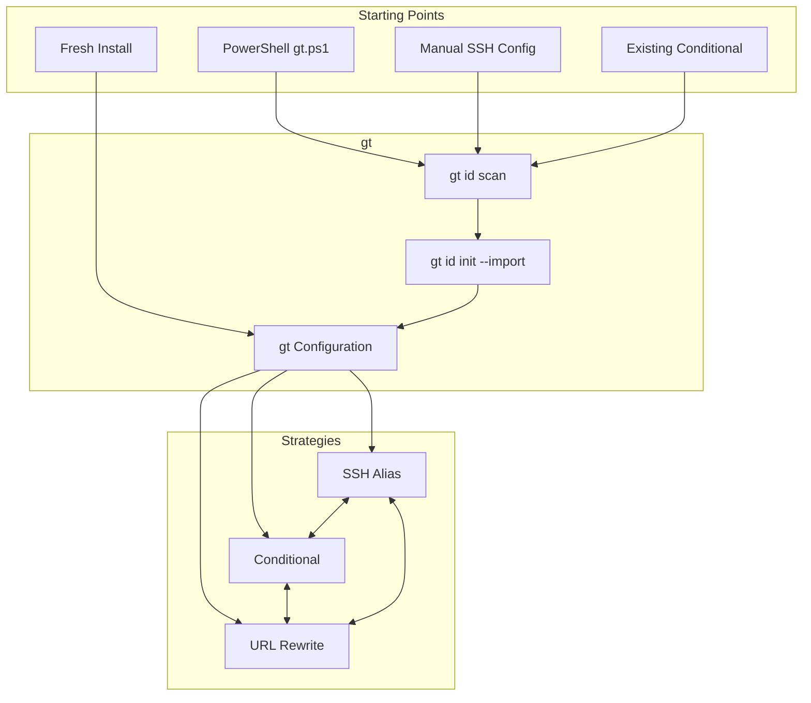
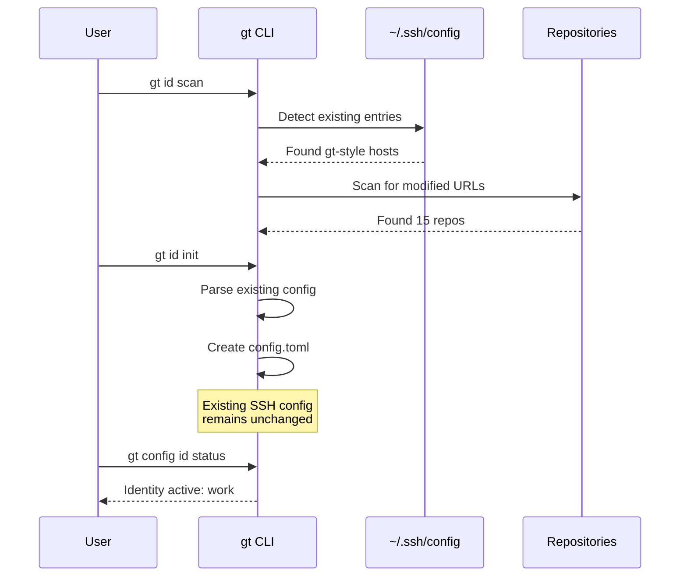
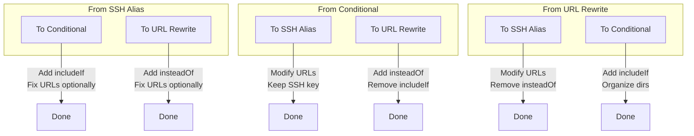

# 007 - Migration Guide

This document covers migrating from existing identity setups to gt, migrating between strategies, and fixing repository configurations.

## Table of Contents

- [Migration Overview](#migration-overview)
- [Importing Existing Configuration](#importing-existing-configuration)
- [From PowerShell Script](#from-powershell-script)
- [Strategy Migration](#strategy-migration)
- [URL Fixing](#url-fixing)
- [Batch Operations](#batch-operations)
- [Rollback Procedures](#rollback-procedures)
- [Troubleshooting](#troubleshooting)

## Migration Overview

### Migration Paths



### Migration Safety

All migrations follow these safety principles:

1. **Backup first**: All modified files are backed up
2. **Dry-run available**: Preview changes before applying
3. **Atomic operations**: Changes succeed fully or roll back
4. **Reversible**: All migrations can be undone

## Importing Existing Configuration

### Auto-Detection

```bash
$ gt id scan

Scanning for existing identity configurations...

SSH Configuration (~/.ssh/config)
=================================
Found 3 gt-style entries:

  [1] Host gt-work.github.com
      Identity: work
      Provider: GitHub
      Key: ~/.ssh/id_gt_work
      Status: Ready to import

  [2] Host gt-personal.github.com
      Identity: personal
      Provider: GitHub
      Key: ~/.ssh/id_gt_personal
      Status: Ready to import

  [3] Host company-gl
      Identity: company
      Provider: GitLab (custom)
      Key: ~/.ssh/id_company
      Status: Needs review (custom format)

Git Configuration (~/.gitconfig)
================================
Found 2 conditional includes:

  [4] gitdir:~/work/
      File: ~/.gitconfig.d/work
      User: Work Name <work@company.com>
      Status: Ready to import

Repository URLs
===============
Found 15 repositories with modified URLs:
  ~/projects/repo1: gt-work.github.com (work)
  ~/projects/repo2: gt-personal.github.com (personal)
  ... and 13 more

Run 'gt id init' to import these configurations.
```

### Import Process

```bash
$ gt id init

Welcome to gt!

Detected existing identity configurations. Would you like to import them?

[x] Import SSH alias identities (3 found)
[x] Import conditional includes (2 found)
[ ] Import repository URL mappings (15 found)

Proceed with import? [Y/n] y

Importing identities...

Creating backup: ~/.ssh/config -> ~/.ssh/config.20240115_143022.bak
Creating backup: ~/.config/gt/config.toml -> (new file, no backup needed)

Imported 5 identities:
  - work (ssh-alias, github)
  - personal (ssh-alias, github)
  - company (ssh-alias, gitlab)
  - work-conditional (conditional, github)
  - personal-conditional (conditional, github)

Note: Found duplicate identity names for different strategies.
      Would you like to merge them? [Y/n] y

Merged identities:
  - work (ssh-alias + conditional)
  - personal (ssh-alias + conditional)

Configuration saved to ~/.config/gt/config.toml

Next steps:
  1. Review configuration: gt id config --list
  2. Test an identity: gt config id key test work
  3. Set default identity: gt id config default.identity work
```

### Import Options

```bash
# Import with specific strategy preference
gt id init --prefer-strategy ssh-alias

# Import without merging duplicates
gt id init --no-merge

# Import specific identities only
gt id init --import-only work,personal

# Non-interactive import
gt id init --non-interactive --import-all
```

## From PowerShell Script

### Current PowerShell Script Behavior

The existing `gt.ps1` script:
1. Creates SSH keys named `id_gt_{identity}`
2. Modifies repository URLs to `git@gt-{identity}.{provider}:...`
3. Adds SSH config entries with hostname mapping

### Migration Steps



### Compatibility

The Rust gt is fully compatible with the PowerShell script's format:

| PowerShell Format | Rust gt Format | Compatible |
|-------------------|-------------------|------------|
| `id_gt_{id}` | `id_gt_{id}` | Yes |
| `gt-{id}.{host}` | `gt-{id}.{host}` | Yes |
| SSH config format | SSH config format | Yes |

No changes to existing SSH config or keys are required.

### Parallel Usage

You can use both tools during transition:

```bash
# PowerShell (existing workflow)
./gt.ps1 -id work -repo git@github.com:company/repo.git

# Rust gt (new workflow)
gt id clone git@github.com:company/repo.git --identity work

# Both produce the same result:
#   URL: git@gt-work.github.com:company/repo.git
#   SSH: Uses ~/.ssh/id_gt_work
```

## Strategy Migration

### SSH Alias to Conditional

```bash
$ gt config id migrate conditional --identity work --dry-run

Migration Plan: SSH Alias -> Conditional
========================================

Identity: work
Current Strategy: SSH Alias

Will perform:
  1. Create ~/.gitconfig.d/work with:
     [user]
       name = Work Name
       email = work@company.com
     [core]
       sshCommand = ssh -i ~/.ssh/id_gt_work -o IdentitiesOnly=yes

  2. Add to ~/.gitconfig:
     [includeIf "gitdir:~/work/"]
       path = ~/.gitconfig.d/work

  3. Optionally fix repository URLs (15 repos found)

  4. SSH config entry will remain (for backward compatibility)

Proceed? This is a dry run, no changes will be made.

$ gt config id migrate conditional --identity work

Creating backup: ~/.gitconfig -> ~/.gitconfig.20240115_144000.bak

[1/3] Creating include file...
      Created: ~/.gitconfig.d/work

[2/3] Adding conditional include...
      Modified: ~/.gitconfig

[3/3] Fix repository URLs? [Y/n] y
      Would you like to move repositories to ~/work? [y/N] y

      Moving: ~/projects/work-repo1 -> ~/work/work-repo1
      Fixing URL: git@gt-work.github.com:... -> git@github.com:...

Migration complete!

Note: SSH config entry 'gt-work.github.com' preserved for compatibility.
      Remove with: gt config id migrate conditional --identity work --cleanup
```

### Conditional to URL Rewrite

```bash
$ gt config id migrate url-rewrite --identity work

Migration Plan: Conditional -> URL Rewrite
==========================================

Identity: work
Current Strategy: Conditional
Directory: ~/work/

Will perform:
  1. Add to ~/.gitconfig:
     [url "git@work-gh:"]
       insteadOf = git@github.com:company-org/

  2. Add to ~/.ssh/config (if not exists):
     Host work-gh
       HostName github.com
       User git
       IdentityFile ~/.ssh/id_gt_work
       IdentitiesOnly yes

  3. Remove conditional include (optional)

Proceed? [Y/n]
```

### Migration Matrix



## URL Fixing

### URL Restoration

Restore original URLs from SSH alias format:

```bash
$ gt id fix --restore

Scanning for modified URLs...

Found 15 repositories with gt-modified URLs:

  ~/projects/repo1
    Current: git@gt-work.github.com:company/repo1.git
    Restore: git@github.com:company/repo1.git

  ~/projects/repo2
    Current: git@gt-personal.github.com:user/repo2.git
    Restore: git@github.com:user/repo2.git

  ...

Fix all URLs? [Y/n] y

[1/15] Fixing ~/projects/repo1... Done
[2/15] Fixing ~/projects/repo2... Done
...
[15/15] Fixing ~/projects/repo15... Done

All URLs restored to original format.
```

### URL Update

Update URLs to a different identity:

```bash
$ gt id fix --identity new-work --repo ~/projects/repo1

Current: git@gt-work.github.com:company/repo1.git
New:     git@gt-new-work.github.com:company/repo1.git

Update URL? [Y/n] y

URL updated successfully.
```

### Batch URL Fixing

```bash
$ gt id fix --recursive ~/projects --identity work

Scanning ~/projects for repositories...
Found 25 repositories

Filter by current identity:
  [a] All repositories
  [w] Only 'work' identity (12 found)
  [p] Only 'personal' identity (8 found)
  [n] Only non-gt URLs (5 found)
> w

Will update 12 repositories to use identity 'work'.

Proceed? [Y/n] y

[1/12] ~/projects/repo1... Updated
...
```

### URL Detection Algorithm

```rust
/// Detects the original provider from a potentially modified URL
pub fn detect_original_provider(url: &str) -> Option<(Provider, Option<String>)> {
    // Pattern 1: gt-{identity}.{provider}
    // git@gt-work.github.com:owner/repo.git
    let gitid_re = Regex::new(
        r"^git@gt-([^.]+)\.([^:]+):(.+)$"
    ).unwrap();

    if let Some(caps) = gitid_re.captures(url) {
        let identity = caps.get(1)?.as_str().to_string();
        let hostname = caps.get(2)?.as_str();
        let provider = Provider::from_hostname(hostname)?;
        return Some((provider, Some(identity)));
    }

    // Pattern 2: Standard URL
    // git@github.com:owner/repo.git
    let standard_re = Regex::new(
        r"^git@([^:]+):(.+)$"
    ).unwrap();

    if let Some(caps) = standard_re.captures(url) {
        let hostname = caps.get(1)?.as_str();
        let provider = Provider::from_hostname(hostname)?;
        return Some((provider, None));
    }

    // Pattern 3: HTTPS URL
    // https://github.com/owner/repo.git
    let https_re = Regex::new(
        r"^https://([^/]+)/(.+)$"
    ).unwrap();

    if let Some(caps) = https_re.captures(url) {
        let hostname = caps.get(1)?.as_str();
        let provider = Provider::from_hostname(hostname)?;
        return Some((provider, None));
    }

    None
}

/// Transforms a URL to use a specific identity
pub fn transform_url(url: &str, identity: &str, strategy: Strategy) -> Result<String> {
    let (provider, _existing_id) = detect_original_provider(url)
        .ok_or(Error::UnrecognizedUrlFormat(url.to_string()))?;

    match strategy {
        Strategy::SshAlias => {
            // Transform to: git@gt-{identity}.{provider}:path
            let original_host = provider.hostname();
            let new_host = format!("gt-{}.{}", identity, original_host);

            let path = extract_path(url)?;
            Ok(format!("git@{}:{}", new_host, path))
        }
        Strategy::Conditional | Strategy::UrlRewrite => {
            // Restore to original format
            let original_host = provider.hostname();
            let path = extract_path(url)?;
            Ok(format!("git@{}:{}", original_host, path))
        }
    }
}
```

## Batch Operations

### Migrate All Identities

```bash
$ gt config id migrate url-rewrite --all

This will migrate all 5 identities to URL Rewrite strategy.

Identities to migrate:
  - work (currently: ssh-alias)
  - personal (currently: ssh-alias)
  - client (currently: ssh-alias)
  - oss (currently: conditional)
  - temp (currently: ssh-alias)

Continue? [Y/n] y

[1/5] Migrating 'work'...
      Adding URL rewrite rule for company-org/
      Done

[2/5] Migrating 'personal'...
...

All identities migrated successfully.
```

### Fix All Repositories

```bash
$ gt id fix --recursive ~ --dry-run

Scanning home directory for Git repositories...
Found 47 repositories

Summary:
  - 23 with gt-modified URLs
  - 18 with standard URLs
  - 6 with unrecognized formats

Actions:
  --restore    Restore all 23 modified URLs to original
  --update     Update URLs to match current identity config
  --verify     Only report issues, don't change anything

$ gt id fix --recursive ~ --verify

Verification Results:
=====================

OK (35 repositories):
  All URLs match expected format for their identity

Issues (12 repositories):
  ~/old-project: Using 'work' but identity deleted
  ~/temp-clone: Modified URL but identity 'temp' not configured
  ...

Recommendations:
  - Run 'gt id fix --restore' on repositories with deleted identities
  - Run 'gt config id add temp' to add missing identity
```

## Rollback Procedures

### Using Backups

```bash
$ ls ~/.ssh/*.bak
config.20240115_140000.bak
config.20240115_143022.bak

$ gt id config --restore-backup

Available backups:

~/.ssh/config:
  [1] config.20240115_143022.bak (2 hours ago)
  [2] config.20240115_140000.bak (5 hours ago)

~/.gitconfig:
  [1] .gitconfig.20240115_144000.bak (1 hour ago)

~/.config/gt/config.toml:
  [1] config.toml.20240115_143022.bak (2 hours ago)

Select backup to restore (or 'q' to quit): 1

Restore ~/.ssh/config from config.20240115_143022.bak?
Current file will be backed up first. [Y/n] y

Backup created: config.20240115_150000.bak
Restored: ~/.ssh/config

Note: You may need to fix repository URLs manually.
Run 'gt id scan' to check current state.
```

### Manual Rollback

```bash
# Restore SSH config
cp ~/.ssh/config.20240115_143022.bak ~/.ssh/config

# Restore Git config
cp ~/.gitconfig.20240115_144000.bak ~/.gitconfig

# Restore gt id config
cp ~/.config/gt/config.toml.bak ~/.config/gt/config.toml

# Verify
gt id scan
```

### Undo Last Migration

```bash
$ gt config id migrate --undo

Last migration:
  Type: SSH Alias -> Conditional
  Identity: work
  Date: 2024-01-15 14:40:00

This will:
  1. Remove includeIf entry from ~/.gitconfig
  2. Remove ~/.gitconfig.d/work
  3. Restore repository URLs (if changed)

Proceed? [Y/n]
```

## Troubleshooting

### Common Issues

#### Identity Not Found

```
Error: Identity 'work' not found in gt id configuration.

Did you mean:
  - work-old (ssh-alias)
  - work2 (conditional)

Run 'gt config id list' to see all identities.
Run 'gt id scan' to detect unimported identities.
```

#### URL Format Unrecognized

```
Error: Unrecognized URL format: git@custom-host:repo.git

This URL doesn't match any known provider pattern.

Options:
  1. Add a custom provider:
     gt id config providers.custom.hostname custom-host

  2. Force identity:
     gt id fix --identity work --force

  3. Skip this repository:
     gt id fix --skip-unrecognized
```

#### Permission Denied

```
Error: Cannot modify ~/.ssh/config: Permission denied

The SSH config file has incorrect permissions or ownership.

Fix:
  chmod 600 ~/.ssh/config
  chown $USER ~/.ssh/config
```

#### SSH Key Not Found

```
Error: SSH key not found: ~/.ssh/id_gt_work

The SSH key for identity 'work' is missing.

Options:
  1. Generate new key:
     gt config id key generate work

  2. Use existing key:
     gt id config --identity work ssh.key_path ~/.ssh/existing_key

  3. Check for moved/renamed key:
     ls ~/.ssh/id_*
```

### Diagnostic Commands

```bash
# Full system diagnostic
gt id scan --deep --verbose

# Verify all identities
gt config id status --all

# Test specific identity
gt config id key test work

# Validate configuration
gt id config --validate

# Check file permissions
gt id scan --check-permissions
```

## Next Steps

Continue to [008-development.md](008-development.md) for developer documentation.
