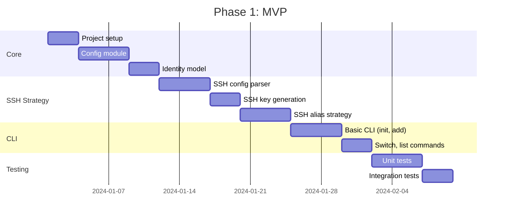
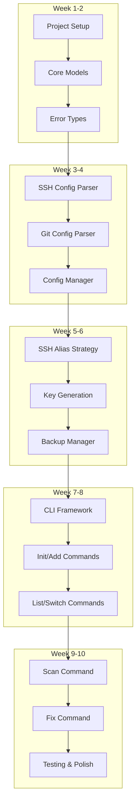

# 008 - Development Guide

This document covers development setup, testing, contribution guidelines, and implementation details for gt.

## Table of Contents

- [Development Setup](#development-setup)
- [Rust Version Requirements](#rust-version-requirements)
- [Project Structure](#project-structure)
- [Building](#building)
- [Testing](#testing)
- [Code Style](#code-style)
- [Architecture Patterns](#architecture-patterns)
- [Adding Features](#adding-features)
- [Release Process](#release-process)
- [Implementation Roadmap](#implementation-roadmap)

## Development Setup

### Prerequisites

| Tool | Version | Purpose |
|------|---------|---------|
| Rust | 1.75.0+ | Compiler and toolchain |
| Git | 2.0+ | Version control, testing |
| OpenSSH | 8.0+ | SSH operations |
| cargo-watch | latest | Development hot-reload |
| cargo-nextest | latest | Fast test runner |

### Environment Setup

```bash
# Install Rust (if not already installed)
curl --proto '=https' --tlsv1.2 -sSf https://sh.rustup.rs | sh

# Ensure minimum version
rustup update stable
rustc --version  # Should be 1.75.0 or higher

# Install development tools
cargo install cargo-watch cargo-nextest cargo-deny cargo-audit

# Clone repository
git clone https://github.com/mattmccartyllc/gt.git
cd gt/rust

# Verify setup
cargo check
cargo test
```

### IDE Setup

#### VS Code

```json
// .vscode/settings.json
{
    "rust-analyzer.cargo.features": "all",
    "rust-analyzer.checkOnSave.command": "clippy",
    "editor.formatOnSave": true,
    "[rust]": {
        "editor.defaultFormatter": "rust-lang.rust-analyzer"
    }
}
```

#### JetBrains (CLion/IntelliJ)

1. Install Rust plugin
2. Open `rust/` directory
3. Enable "Expand macros" for better analysis

## Rust Version Requirements

### Minimum Version: 1.75.0

gt requires Rust 1.75.0 or later for:

| Feature | Rust Version | Usage |
|---------|--------------|-------|
| `async fn` in traits | 1.75.0 | Async strategy trait |
| `let else` | 1.65.0 | Cleaner error handling |
| GATs | 1.65.0 | Generic parsers |
| `cargo new` edition | 1.70.0 | Edition 2021 |

### Version Check

```rust
// build.rs
fn main() {
    let version = rustc_version::version().unwrap();
    if version < rustc_version::Version::parse("1.75.0").unwrap() {
        panic!("gt requires Rust 1.75.0 or later");
    }
}
```

### Updating Rust

```bash
rustup update stable
rustup default stable
```

## Project Structure

```
rust/
├── Cargo.toml              # Workspace manifest
├── Cargo.lock              # Dependency lock
├── README.md               # Project readme
├── docs/                   # Documentation
│
├── src/
│   ├── main.rs             # Binary entry point
│   ├── lib.rs              # Library root
│   │
│   ├── cli/                # CLI layer
│   │   ├── mod.rs
│   │   ├── args.rs         # Clap argument definitions
│   │   ├── output.rs       # Output formatters
│   │   └── interactive.rs  # Dialoguer prompts
│   │
│   ├── cmd/                # Command implementations
│   │   ├── mod.rs
│   │   ├── init.rs
│   │   ├── scan.rs
│   │   ├── add.rs
│   │   ├── list.rs
│   │   ├── switch.rs
│   │   ├── clone.rs
│   │   ├── config.rs
│   │   ├── migrate.rs
│   │   ├── fix.rs
│   │   ├── key.rs
│   │   └── status.rs
│   │
│   ├── core/               # Domain logic
│   │   ├── mod.rs
│   │   ├── identity.rs     # Identity model
│   │   ├── repo.rs         # Repository model
│   │   ├── url.rs          # URL parsing
│   │   ├── path.rs         # Path utilities
│   │   └── provider.rs     # Provider definitions
│   │
│   ├── strategy/           # Strategy implementations
│   │   ├── mod.rs          # Strategy trait
│   │   ├── ssh_alias.rs
│   │   ├── conditional.rs
│   │   └── url_rewrite.rs
│   │
│   ├── io/                 # I/O operations
│   │   ├── mod.rs
│   │   ├── ssh_config.rs   # SSH config parser
│   │   ├── git_config.rs   # Git config parser
│   │   ├── ssh_key.rs      # Key generation
│   │   ├── backup.rs       # Backup manager
│   │   └── toml_config.rs  # TOML config
│   │
│   ├── scan/               # Detection/scanning
│   │   ├── mod.rs
│   │   ├── detector.rs
│   │   ├── ssh_scanner.rs
│   │   ├── git_scanner.rs
│   │   └── report.rs
│   │
│   ├── error.rs            # Error types
│   └── util.rs             # Utilities
│
├── tests/                  # Integration tests
│   ├── common/
│   │   └── mod.rs
│   ├── init_test.rs
│   ├── scan_test.rs
│   ├── strategy_test.rs
│   └── fixtures/
│       ├── ssh_config/
│       ├── git_config/
│       └── repos/
│
└── benches/                # Benchmarks
    └── url_parsing.rs
```

## Building

### Development Build

```bash
cd rust

# Check code without building
cargo check

# Build debug version
cargo build

# Run directly
cargo run -- scan

# Watch for changes
cargo watch -x check -x test
```

### Release Build

```bash
# Optimized build
cargo build --release

# With LTO for smaller binary
CARGO_PROFILE_RELEASE_LTO=true cargo build --release

# Cross-compile for Windows (from Linux)
cargo build --release --target x86_64-pc-windows-gnu
```

### Build Features

```toml
# Cargo.toml
[features]
default = ["color", "interactive"]
color = ["colored"]
interactive = ["dialoguer"]
json = ["serde_json"]
```

```bash
# Build without optional features
cargo build --no-default-features

# Build with specific features
cargo build --features "json"
```

## Testing

### Test Organization

```
tests/
├── common/
│   └── mod.rs           # Shared test utilities
├── unit/                # Unit tests (in src/ modules)
├── integration/         # Integration tests
│   ├── init_test.rs
│   ├── scan_test.rs
│   └── strategy_test.rs
└── fixtures/            # Test data
    ├── ssh_config/
    │   ├── simple.config
    │   ├── gitid_style.config
    │   └── complex.config
    ├── git_config/
    │   ├── simple.gitconfig
    │   └── conditional.gitconfig
    └── repos/
        └── mock_repo/
```

### Running Tests

```bash
# Run all tests
cargo test

# Run with output
cargo test -- --nocapture

# Run specific test
cargo test test_url_parsing

# Run integration tests only
cargo test --test '*'

# Use nextest for faster execution
cargo nextest run

# With coverage (requires cargo-llvm-cov)
cargo llvm-cov --html
```

### Test Utilities

```rust
// tests/common/mod.rs
use tempfile::TempDir;
use std::path::PathBuf;

pub struct TestEnv {
    pub temp_dir: TempDir,
    pub home: PathBuf,
    pub ssh_dir: PathBuf,
    pub config_dir: PathBuf,
}

impl TestEnv {
    pub fn new() -> Self {
        let temp_dir = TempDir::new().unwrap();
        let home = temp_dir.path().to_owned();
        let ssh_dir = home.join(".ssh");
        let config_dir = home.join(".config").join("gt");

        std::fs::create_dir_all(&ssh_dir).unwrap();
        std::fs::create_dir_all(&config_dir).unwrap();

        Self {
            temp_dir,
            home,
            ssh_dir,
            config_dir,
        }
    }

    pub fn create_ssh_config(&self, content: &str) -> PathBuf {
        let path = self.ssh_dir.join("config");
        std::fs::write(&path, content).unwrap();
        path
    }

    pub fn create_identity(&self, name: &str) -> PathBuf {
        let key_path = self.ssh_dir.join(format!("id_gt_{}", name));
        std::fs::write(&key_path, "mock private key").unwrap();
        std::fs::write(
            key_path.with_extension("pub"),
            "ssh-ed25519 AAAA... test@test"
        ).unwrap();
        key_path
    }
}

#[macro_export]
macro_rules! assert_url_transforms {
    ($url:expr, $identity:expr, $expected:expr) => {
        let result = transform_url($url, $identity, Strategy::SshAlias).unwrap();
        assert_eq!(result, $expected);
    };
}
```

### Fixture-Based Tests

```rust
#[test]
fn test_parse_gitid_ssh_config() {
    let content = include_str!("fixtures/ssh_config/gitid_style.config");
    let config = SshConfig::parse(content).unwrap();

    assert_eq!(config.hosts.len(), 3);
    assert!(config.has_host("gt-work.github.com"));
}
```

## Code Style

### Formatting

```bash
# Format code
cargo fmt

# Check formatting
cargo fmt -- --check
```

### Linting

```bash
# Run clippy
cargo clippy -- -D warnings

# With extra lints
cargo clippy -- -D warnings -W clippy::pedantic
```

### Style Guidelines

```rust
// 1. Error handling with context
use anyhow::{Context, Result};

fn load_config(path: &Path) -> Result<Config> {
    let content = std::fs::read_to_string(path)
        .with_context(|| format!("Failed to read config: {}", path.display()))?;

    toml::from_str(&content)
        .with_context(|| "Failed to parse config")
}

// 2. Builder pattern for complex structs
pub struct IdentityBuilder {
    name: String,
    email: Option<String>,
    provider: Option<Provider>,
}

impl IdentityBuilder {
    pub fn new(name: impl Into<String>) -> Self {
        Self {
            name: name.into(),
            email: None,
            provider: None,
        }
    }

    pub fn email(mut self, email: impl Into<String>) -> Self {
        self.email = Some(email.into());
        self
    }

    pub fn build(self) -> Result<Identity> {
        Ok(Identity {
            name: self.name,
            email: self.email.ok_or(Error::MissingField("email"))?,
            provider: self.provider.unwrap_or_default(),
        })
    }
}

// 3. Trait-based abstraction
pub trait ConfigParser {
    type Output;

    fn parse(&self, content: &str) -> Result<Self::Output>;
    fn serialize(&self, value: &Self::Output) -> Result<String>;
}

// 4. Descriptive error types
#[derive(Debug, thiserror::Error)]
pub enum UrlError {
    #[error("Unrecognized URL format: {url}")]
    UnrecognizedFormat { url: String },

    #[error("Unknown provider: {hostname}")]
    UnknownProvider { hostname: String },

    #[error("Missing path in URL: {url}")]
    MissingPath { url: String },
}
```

## Architecture Patterns

### Strategy Pattern

```rust
// strategy/mod.rs
pub trait Strategy: Send + Sync {
    fn name(&self) -> &'static str;
    fn apply(&self, identity: &Identity, repo: &Repo) -> Result<()>;
    fn remove(&self, identity: &Identity, repo: &Repo) -> Result<()>;
    fn is_active(&self, identity: &Identity, repo: &Repo) -> Result<bool>;
}

// Factory for strategies
pub fn create_strategy(strategy_type: StrategyType) -> Box<dyn Strategy> {
    match strategy_type {
        StrategyType::SshAlias => Box::new(SshAliasStrategy::new()),
        StrategyType::Conditional => Box::new(ConditionalStrategy::new()),
        StrategyType::UrlRewrite => Box::new(UrlRewriteStrategy::new()),
    }
}
```

### Repository Pattern

```rust
// io/config_repo.rs
pub trait ConfigRepository {
    fn load(&self) -> Result<Config>;
    fn save(&self, config: &Config) -> Result<()>;
    fn exists(&self) -> bool;
}

pub struct FileConfigRepository {
    path: PathBuf,
    backup_manager: BackupManager,
}

impl ConfigRepository for FileConfigRepository {
    fn load(&self) -> Result<Config> {
        let content = std::fs::read_to_string(&self.path)?;
        toml::from_str(&content).map_err(Into::into)
    }

    fn save(&self, config: &Config) -> Result<()> {
        self.backup_manager.create_backup(&self.path)?;
        let content = toml::to_string_pretty(config)?;
        std::fs::write(&self.path, content)?;
        Ok(())
    }

    fn exists(&self) -> bool {
        self.path.exists()
    }
}
```

### Command Pattern

```rust
// cmd/mod.rs
pub trait Command {
    fn execute(&self, ctx: &Context) -> Result<Output>;
}

pub struct Context {
    pub config: Config,
    pub output_format: OutputFormat,
    pub dry_run: bool,
    pub verbose: bool,
}

// Example command
pub struct SwitchCommand {
    identity: String,
    repo_path: Option<PathBuf>,
}

impl Command for SwitchCommand {
    fn execute(&self, ctx: &Context) -> Result<Output> {
        let identity = ctx.config.get_identity(&self.identity)?;
        let repo = Repo::detect(&self.repo_path)?;
        let strategy = create_strategy(identity.strategy);

        if ctx.dry_run {
            return Ok(Output::dry_run(format!(
                "Would switch {} to identity '{}'",
                repo.path.display(),
                self.identity
            )));
        }

        strategy.apply(&identity, &repo)?;

        Ok(Output::success(format!(
            "Switched to identity '{}'",
            self.identity
        )))
    }
}
```

## Adding Features

### Adding a New Command

1. Create command file:

```rust
// src/cmd/newcmd.rs
use crate::prelude::*;

pub struct NewCmdOptions {
    pub arg: String,
    pub flag: bool,
}

pub fn execute(opts: NewCmdOptions, ctx: &Context) -> Result<Output> {
    // Implementation
    Ok(Output::success("Done"))
}
```

2. Add to CLI args:

```rust
// src/cli/args.rs
#[derive(Subcommand)]
pub enum Commands {
    // ...existing commands
    /// Description of new command
    NewCmd {
        #[arg(short, long)]
        arg: String,

        #[arg(short, long)]
        flag: bool,
    },
}
```

3. Wire up in main:

```rust
// src/main.rs
Commands::NewCmd { arg, flag } => {
    cmd::newcmd::execute(
        cmd::newcmd::NewCmdOptions { arg, flag },
        &ctx,
    )
}
```

4. Add tests:

```rust
// tests/newcmd_test.rs
#[test]
fn test_newcmd_basic() {
    // Test implementation
}
```

### Adding a New Provider

```rust
// src/core/provider.rs
pub enum Provider {
    GitHub,
    GitLab,
    Bitbucket,
    Azure,
    CodeCommit,
    Custom(CustomProvider),
    // Add new provider
    NewProvider,
}

impl Provider {
    pub fn from_hostname(hostname: &str) -> Option<Self> {
        match hostname {
            "github.com" => Some(Provider::GitHub),
            "gitlab.com" => Some(Provider::GitLab),
            // Add new provider
            "newprovider.com" => Some(Provider::NewProvider),
            // ...
            _ => None,
        }
    }

    pub fn hostname(&self) -> &str {
        match self {
            Provider::GitHub => "github.com",
            Provider::NewProvider => "newprovider.com",
            // ...
        }
    }
}
```

## Release Process

### Version Bumping

```bash
# Update version in Cargo.toml
cargo set-version 0.2.0

# Or manually edit Cargo.toml
```

### Changelog

```markdown
# Changelog

## [0.2.0] - 2024-01-20

### Added
- New `gt id newcmd` command
- Support for NewProvider

### Changed
- Improved URL parsing performance

### Fixed
- Windows path handling edge case
```

### Creating Release

```bash
# Ensure all tests pass
cargo test

# Build release binaries
./scripts/build-release.sh

# Create git tag
git tag -a v0.2.0 -m "Release v0.2.0"
git push origin v0.2.0
```

## Implementation Roadmap

### Phase 1: MVP (Core Functionality)



**MVP Features:**
- `gt id init` - Basic setup
- `gt id add` - Add identity (SSH alias only)
- `gt id list` - List identities
- `gt id switch` - Switch identity
- `gt id key generate` - Generate SSH key
- `gt id scan` - Basic detection

### Phase 2: Enhanced Features

**Timeline:** 4-6 weeks after MVP

**Features:**
- `gt id clone` - Clone with identity
- `gt id fix` - URL fixing
- `gt id migrate` - Strategy migration
- Conditional includes strategy
- URL rewrite strategy
- JSON/CSV output formats
- Backup management
- Import from existing configs

### Phase 3: Advanced Features

**Timeline:** 4-6 weeks after Phase 2

**Features:**
- `gt id key test` - Test authentication
- `gt id status` - Detailed status
- Interactive mode improvements
- Custom provider support
- Azure DevOps support
- AWS CodeCommit support
- Performance optimizations
- Plugin system (future)

### Implementation Order



## Next Steps

Continue to [009-big-picture.md](009-big-picture.md) for the complete system overview.
