# 009 - Big Picture

This document provides the comprehensive system overview, tying together all components into a unified architecture view.

## Table of Contents

- [System Architecture](#system-architecture)
- [Data Flow Overview](#data-flow-overview)
- [Component Interactions](#component-interactions)
- [State Management](#state-management)
- [External Integrations](#external-integrations)
- [Complete System Diagram](#complete-system-diagram)

## System Architecture

### Layered Architecture

gt follows a clean layered architecture with clear separation of concerns:

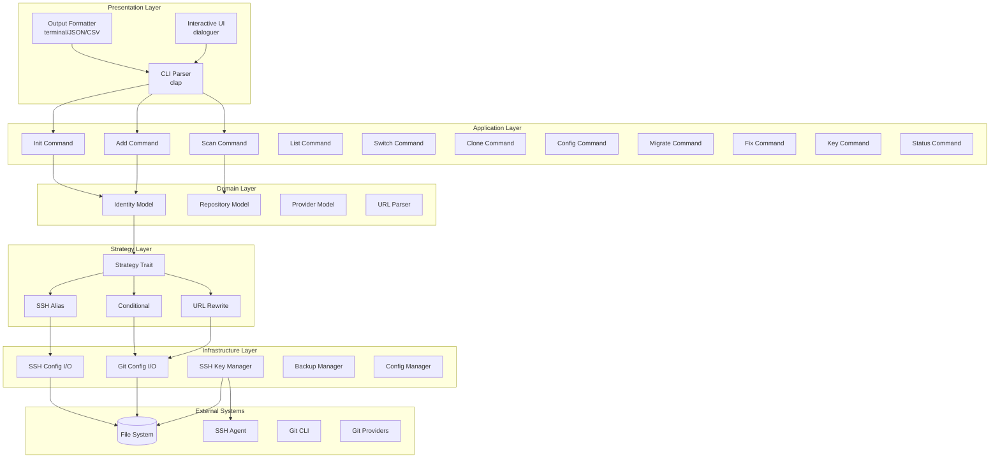

### Module Dependencies

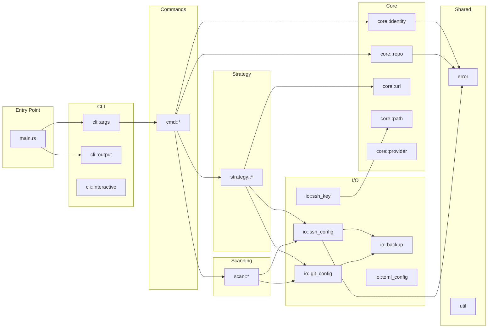

## Data Flow Overview

### Identity Creation Flow

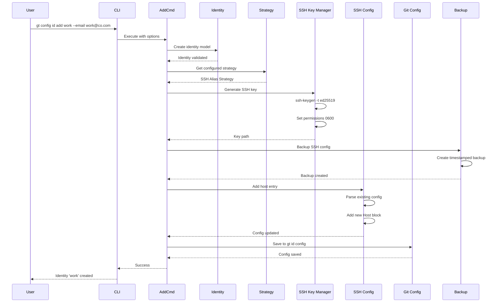

### Repository Switch Flow

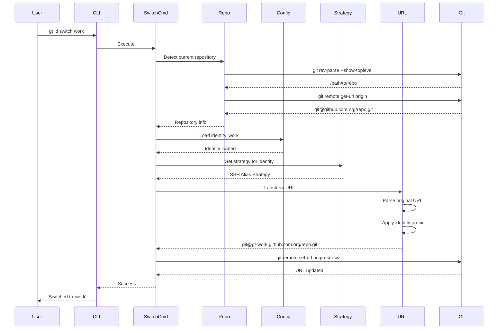

### Scan and Detection Flow

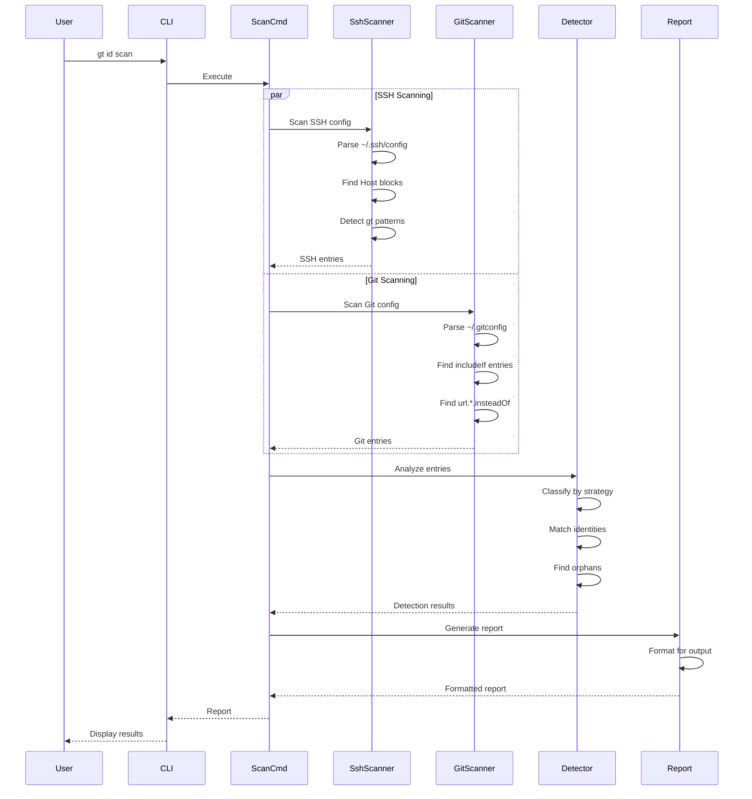

## Component Interactions

### Strategy Selection

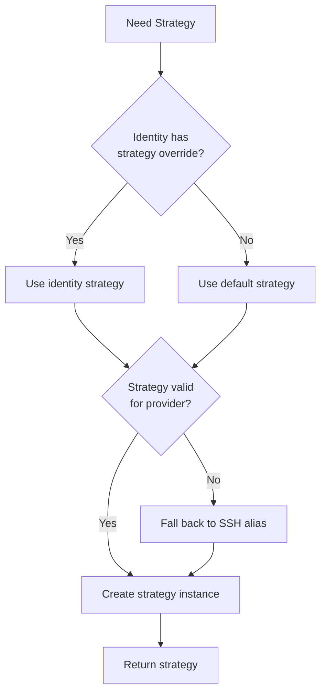

### Configuration Resolution

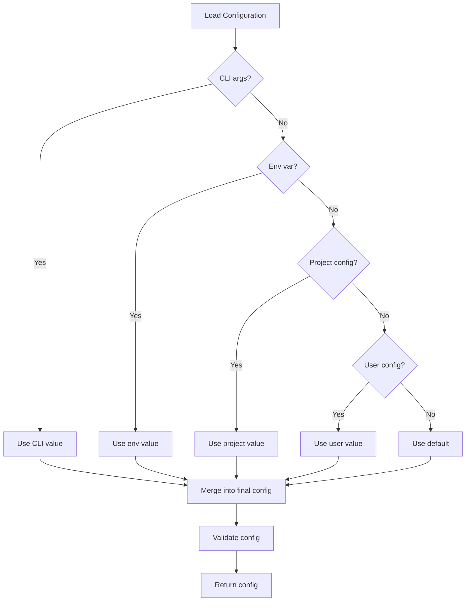

### Backup and Recovery

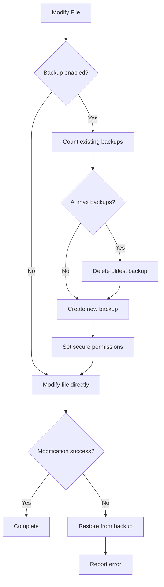

## State Management

### Identity State Machine

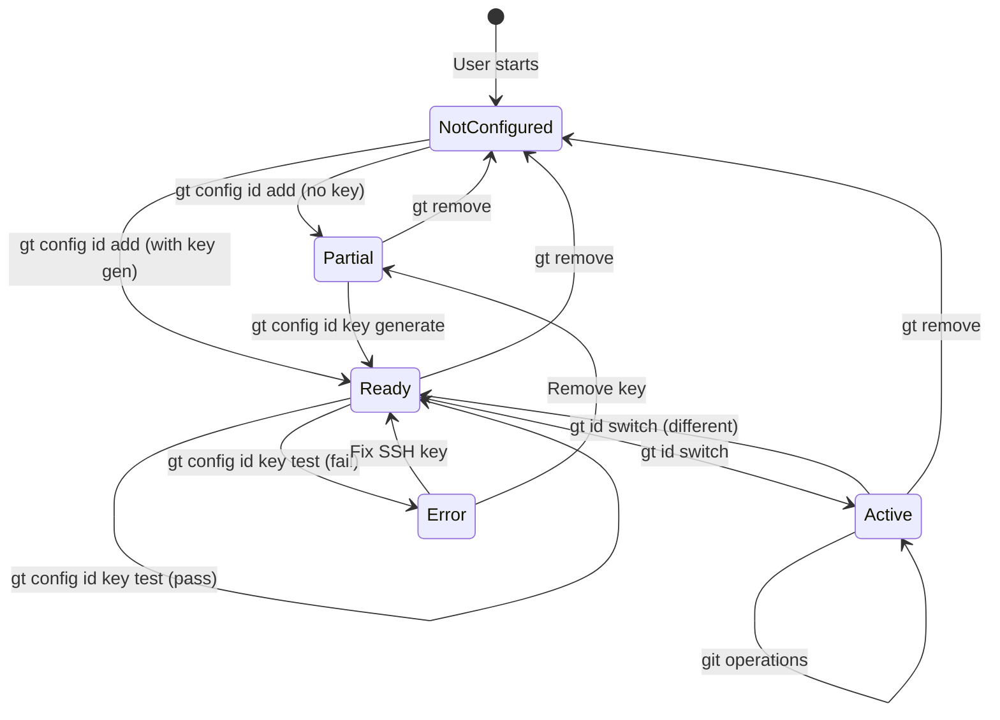

### Repository State

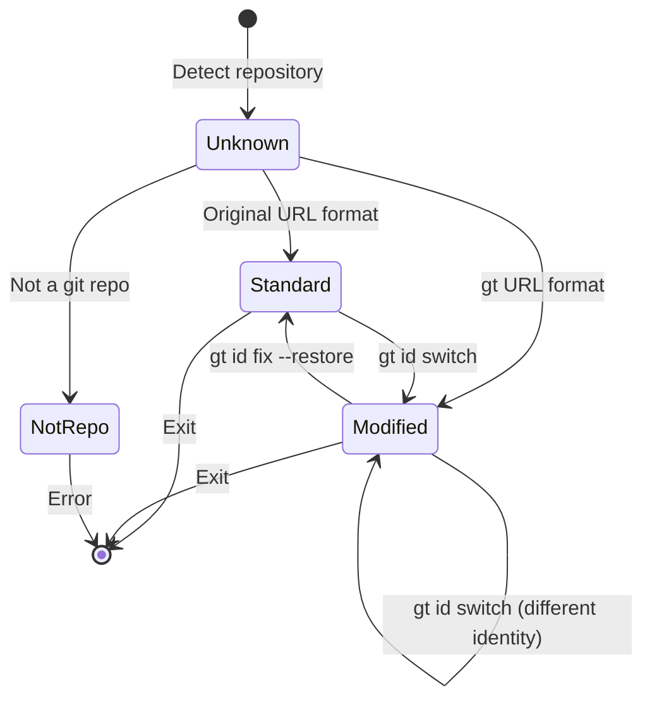

## External Integrations

### Git Provider Communication

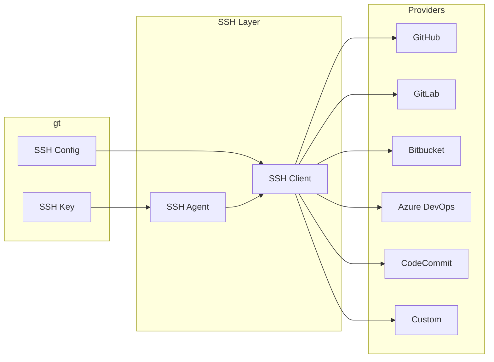

### File System Layout

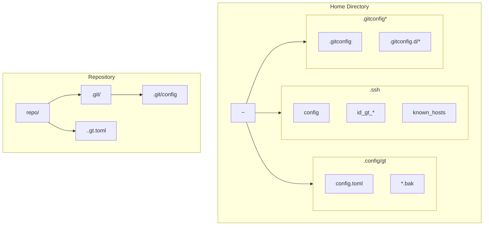

## Complete System Diagram

This diagram shows the entire gt system with all components, data flows, and external integrations:

```mermaid
flowchart TB
    subgraph USER["User Interface"]
        direction LR
        TERM[Terminal]
        SCRIPT[Scripts/CI]
    end

    subgraph CLI_LAYER["CLI Layer"]
        direction TB
        CLAP[Argument Parser<br/>clap]
        DIALOG[Interactive Prompts<br/>dialoguer]
        FORMAT[Output Formatter<br/>terminal/JSON/CSV]
    end

    subgraph CMD_LAYER["Command Layer"]
        direction TB
        subgraph SETUP["Setup Commands"]
            INIT[init]
            SCAN[scan]
            ADD[add]
        end
        subgraph DAILY["Daily Commands"]
            LIST[list]
            SWITCH[switch]
            CLONE[clone]
            STATUS[status]
        end
        subgraph MAINT["Maintenance"]
            CONFIG[config]
            MIGRATE[migrate]
            FIX[fix]
            KEY[key]
        end
    end

    subgraph CORE_LAYER["Core Domain"]
        direction TB
        ID_MODEL[Identity Model]
        REPO_MODEL[Repository Model]
        PROV_MODEL[Provider Model]
        URL_PARSE[URL Parser]
        PATH_UTIL[Path Utilities]
    end

    subgraph STRAT_LAYER["Strategy Layer"]
        direction TB
        STRAT_TRAIT[Strategy Trait]
        SSH_STRAT[SSH Alias<br/>Strategy]
        COND_STRAT[Conditional<br/>Strategy]
        URL_STRAT[URL Rewrite<br/>Strategy]
    end

    subgraph IO_LAYER["I/O Layer"]
        direction TB
        SSH_PARSE[SSH Config<br/>Parser/Writer]
        GIT_PARSE[Git Config<br/>Parser/Writer]
        KEY_MGR[SSH Key<br/>Manager]
        TOML_MGR[TOML Config<br/>Manager]
        BACKUP_MGR[Backup<br/>Manager]
    end

    subgraph SCAN_LAYER["Detection Layer"]
        direction TB
        DETECTOR[Strategy Detector]
        SSH_SCAN[SSH Scanner]
        GIT_SCAN[Git Scanner]
        REPORT[Report Generator]
    end

    subgraph EXTERN["External Systems"]
        direction TB
        subgraph FILES["File System"]
            SSH_CFG[(~/.ssh/config)]
            SSH_KEYS[(SSH Keys)]
            GIT_GLOBAL[(~/.gitconfig)]
            GITID_CFG[(config.toml)]
            REPO_CFG[(.git/config)]
        end
        subgraph TOOLS["System Tools"]
            SSH_KEYGEN[ssh-keygen]
            SSH_ADD[ssh-add]
            SSH_AGENT[ssh-agent]
            GIT_CLI[git]
        end
        subgraph PROVIDERS["Git Providers"]
            GITHUB[GitHub]
            GITLAB[GitLab]
            BITBUCKET[Bitbucket]
            AZURE[Azure DevOps]
            CODECOMMIT[CodeCommit]
            CUSTOM_PROV[Custom]
        end
    end

    %% User to CLI
    TERM --> CLAP
    SCRIPT --> CLAP
    DIALOG --> TERM
    FORMAT --> TERM

    %% CLI to Commands
    CLAP --> INIT
    CLAP --> SCAN
    CLAP --> ADD
    CLAP --> LIST
    CLAP --> SWITCH
    CLAP --> CLONE
    CLAP --> STATUS
    CLAP --> CONFIG
    CLAP --> MIGRATE
    CLAP --> FIX
    CLAP --> KEY

    %% Commands to Core
    INIT --> ID_MODEL
    ADD --> ID_MODEL
    SWITCH --> ID_MODEL
    SWITCH --> REPO_MODEL
    CLONE --> URL_PARSE
    FIX --> URL_PARSE
    SCAN --> DETECTOR

    %% Core to Strategy
    ID_MODEL --> STRAT_TRAIT
    STRAT_TRAIT --> SSH_STRAT
    STRAT_TRAIT --> COND_STRAT
    STRAT_TRAIT --> URL_STRAT

    %% Strategy to I/O
    SSH_STRAT --> SSH_PARSE
    SSH_STRAT --> KEY_MGR
    COND_STRAT --> GIT_PARSE
    URL_STRAT --> GIT_PARSE

    %% I/O to Files
    SSH_PARSE --> SSH_CFG
    SSH_PARSE --> BACKUP_MGR
    GIT_PARSE --> GIT_GLOBAL
    GIT_PARSE --> REPO_CFG
    GIT_PARSE --> BACKUP_MGR
    KEY_MGR --> SSH_KEYS
    KEY_MGR --> SSH_KEYGEN
    KEY_MGR --> SSH_ADD
    TOML_MGR --> GITID_CFG
    BACKUP_MGR --> SSH_CFG
    BACKUP_MGR --> GIT_GLOBAL

    %% Scanning
    DETECTOR --> SSH_SCAN
    DETECTOR --> GIT_SCAN
    SSH_SCAN --> SSH_CFG
    GIT_SCAN --> GIT_GLOBAL
    DETECTOR --> REPORT
    REPORT --> FORMAT

    %% External connections
    SSH_AGENT --> GITHUB
    SSH_AGENT --> GITLAB
    SSH_AGENT --> BITBUCKET
    SSH_AGENT --> AZURE
    SSH_AGENT --> CODECOMMIT
    SSH_AGENT --> CUSTOM_PROV

    %% Styling
    style USER fill:#e1f5fe
    style CLI_LAYER fill:#f3e5f5
    style CMD_LAYER fill:#fff3e0
    style CORE_LAYER fill:#e8f5e9
    style STRAT_LAYER fill:#fce4ec
    style IO_LAYER fill:#fff8e1
    style SCAN_LAYER fill:#e0f7fa
    style EXTERN fill:#f5f5f5
```

## Summary

gt is designed as a modular, extensible CLI application with:

1. **Clean separation of concerns** across layers
2. **Strategy pattern** for flexible identity management
3. **Cross-platform support** through abstracted I/O
4. **Safety-first approach** with backups and dry-run modes
5. **Extensible architecture** for new providers and strategies

The system handles the complete lifecycle of Git identity management:
- Detection of existing configurations
- Creation and management of identities
- Switching between identities per-repository
- Migration between strategies
- Repair and maintenance of configurations

All components are designed to work together seamlessly while remaining independently testable and maintainable.
